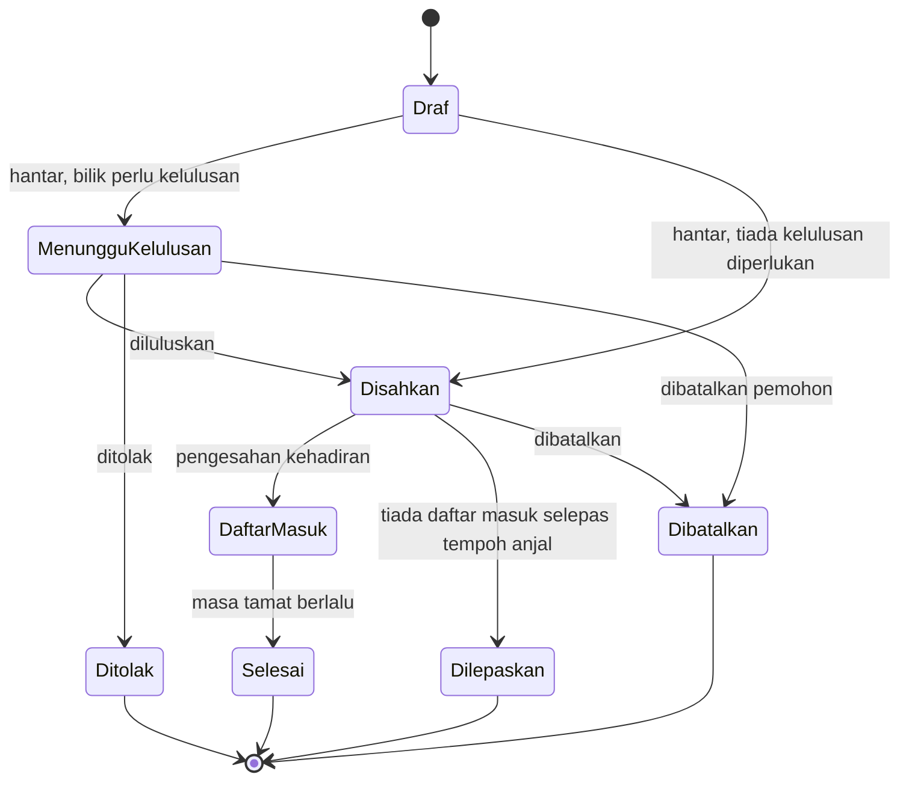
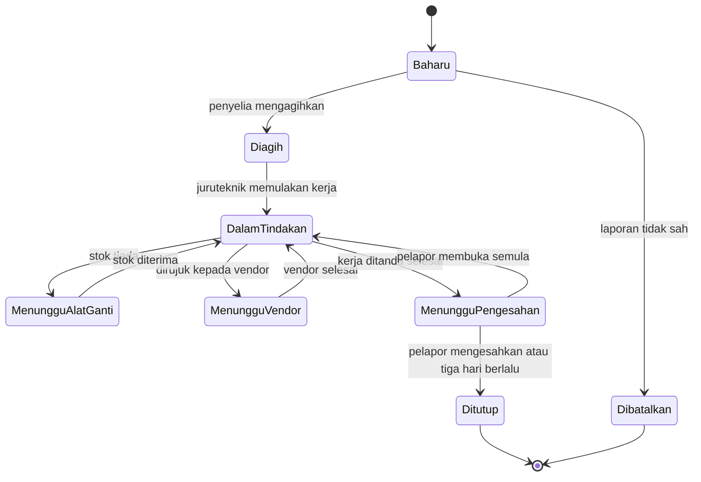

# 04 — SRS: Software Requirements Specification

| Perkara | Butiran |
|---|---|
| Dokumen | Software Requirements Specification (SRS) |
| Sistem | SPFA — Sistem Pengurusan Fasiliti & Aset ICT |
| Versi | 1.0 (Draf) |
| Tarikh | 7 September 2026 |
| Standard rujukan | IEEE 830 (diadaptasi) |

---

## 1. Pengenalan

### 1.1 Tujuan
Dokumen ini menyatakan keperluan fungsian sistem secara terperinci dan boleh diuji. Ia adalah kontrak teknikal antara pemilik proses dan pasukan pembangunan. Setiap keperluan di sini berpunca daripada satu keperluan pengguna dalam URS, dan akan dijejaki hingga ke kes ujian dalam RTM.

### 1.2 Konvensyen Penulisan
- **MESTI** menandakan keperluan wajib. Sistem tidak diterima tanpanya.
- **SEPATUTNYA** menandakan keperluan yang diingini tetapi boleh ditangguh ke fasa seterusnya dengan persetujuan bertulis.
- **BOLEH** menandakan keperluan pilihan.
- Format ID: `FR-<KOD MODUL>-<nombor>`.

### 1.3 Keutamaan
Setiap keperluan diberi keutamaan **W** (wajib fasa 1), **W2** (wajib fasa 2), **W3** (wajib fasa 3) atau **P** (pilihan).

### 1.4 Peranan Sistem

| Kod | Peranan | Skop data |
|---|---|---|
| R1 | Kakitangan | Rekod milik sendiri |
| R2 | Setiausaha | Rekod unit yang diwakili |
| R3 | Pelulus | Rekod menunggu kelulusan dalam skopnya |
| R4 | Pentadbir Fasiliti | Semua data domain bilik |
| R5 | Juruteknik ICT | Tugas yang ditugaskan kepadanya, semua aset baca sahaja |
| R6 | Penyelia ICT | Semua data domain penyelenggaraan |
| R7 | Pegawai Aset | Semua data aset dan vendor |
| R8 | Pentadbir Sistem | Semua data dan konfigurasi |

---

## 2. Keterangan Keseluruhan

### 2.1 Perspektif Produk
Sistem ini adalah aplikasi web berbilang pengguna yang berdiri sendiri, berintegrasi keluar dengan direktori pengguna organisasi, pelayan e-mel, dan aplikasi kalendar melalui fail ICS. Ia tidak menggantikan mana-mana sistem sedia ada, tetapi menggantikan proses manual.

### 2.2 Persekitaran Operasi
Pelayan aplikasi dan pangkalan data dihos dalam pusat data organisasi atau awan tertutup. Klien adalah pelayar web moden pada desktop dan telefon pintar.

### 2.3 Kekangan Reka Bentuk
- Semua tarikh dan masa disimpan dalam UTC dan dipaparkan dalam zon waktu tempatan organisasi.
- Kod QR mesti berfungsi tanpa aplikasi khas; pengimbas kamera lalai telefon memadai kerana kod mengandungi URL.
- Sistem mesti berfungsi tanpa sambungan internet awam jika dihos dalaman.

---

## 3. Keperluan Fungsian

### M01 — Pentadbiran Sistem & Konfigurasi

| ID | Keperluan | Keutamaan | URS |
|---|---|---|---|
| FR-ADM-01 | Sistem MESTI membenarkan pentadbir menetapkan waktu operasi lalai organisasi dan waktu operasi khusus setiap bilik | W | UR-42 |
| FR-ADM-02 | Sistem MESTI membenarkan pentadbir menyelenggara kalendar cuti umum dan hari tanpa tempahan | W | UR-42 |
| FR-ADM-03 | Sistem MESTI membenarkan pentadbir menetapkan tempoh tempahan minimum, tempoh maksimum, dan tempoh awalan maksimum bagi setiap peranan | W | UR-42 |
| FR-ADM-04 | Sistem MESTI membenarkan pentadbir menetapkan ambang daftar masuk dan tempoh anjal sebelum pelepasan automatik | W3 | UR-42 |
| FR-ADM-05 | Sistem MESTI membenarkan pentadbir menetapkan aras keutamaan tiket beserta sasaran masa tindak balas dan masa pemulihan | W2 | UR-42 |
| FR-ADM-06 | Sistem MESTI membenarkan pentadbir menyunting templat notifikasi termasuk subjek dan kandungan, dengan pemegang tempat data | W | UR-42 |
| FR-ADM-07 | Sistem MESTI menyelenggara senarai nilai rujukan yang boleh disunting: kategori aset, jenis kerosakan, susun atur bilik, kemudahan bilik, unit stok | W | UR-42 |
| FR-ADM-08 | Setiap perubahan konfigurasi MESTI direkod dalam jejak audit dengan nilai sebelum dan selepas | W | UR-43 |

**Peraturan pengesahan:** tempoh tempahan minimum mesti kurang daripada tempoh maksimum. Waktu tutup mesti selepas waktu buka. Sasaran masa pemulihan mesti lebih besar daripada sasaran masa tindak balas bagi setiap keutamaan.

### M02 — Pengguna, Peranan & Kawalan Akses

| ID | Keperluan | Keutamaan | URS |
|---|---|---|---|
| FR-USR-01 | Sistem MESTI mengesahkan pengguna melalui direktori organisasi menggunakan LDAP, SAML atau OpenID Connect | W | UR-40 |
| FR-USR-02 | Sistem MESTI menyokong akaun tempatan sebagai sandaran, dengan dasar kata laluan yang boleh dikonfigurasi | W | UR-40 |
| FR-USR-03 | Sistem MESTI menamatkan sesi secara automatik selepas tempoh tidak aktif yang dikonfigurasi, lalai 30 minit | W | — |
| FR-USR-04 | Sistem MESTI menyokong lapan peranan seperti dalam jadual peranan, dan seorang pengguna boleh memegang lebih daripada satu peranan | W | — |
| FR-USR-05 | Sistem MESTI menguatkuasakan kawalan akses pada lapisan pelayan bagi setiap permintaan, bukan hanya menyembunyikan elemen antara muka | W | — |
| FR-USR-06 | Sistem MESTI mengaitkan setiap pengguna dengan unit organisasi dan lokasi utama | W | — |
| FR-USR-07 | Sistem MESTI membenarkan pentadbir menyahaktifkan pengguna tanpa memadam rekod sejarahnya | W | — |
| FR-USR-08 | Sistem MESTI membenarkan pengguna menetapkan wakil sementara bagi tugas kelulusan dalam julat tarikh tertentu | W | UR-08 |
| FR-USR-09 | Sistem SEPATUTNYA menyokong pengesahan dua faktor bagi peranan R8 | W2 | — |
| FR-USR-10 | Sistem MESTI menyekat akaun selepas lima percubaan log masuk gagal berturut-turut dalam 15 minit | W | — |

### M03 — Direktori Organisasi & Lokasi

| ID | Keperluan | Keutamaan | URS |
|---|---|---|---|
| FR-ORG-01 | Sistem MESTI menyimpan hierarki lokasi empat aras: kampus, bangunan, tingkat, ruang | W | UR-11 |
| FR-ORG-02 | Sistem MESTI menyimpan hierarki organisasi sekurang-kurangnya dua aras: bahagian dan unit | W | — |
| FR-ORG-03 | Sistem MESTI menghalang pemadaman lokasi yang mempunyai bilik atau aset aktif | W | — |
| FR-ORG-04 | Sistem MESTI membenarkan penamaan semula lokasi tanpa menjejaskan rekod sejarah | W | — |
| FR-ORG-05 | Sistem MESTI menyediakan pemilih lokasi berbentuk pokok pada semua borang yang memerlukan lokasi | W | — |

### M04 — Katalog Bilik & Sumber

| ID | Keperluan | Keutamaan | URS |
|---|---|---|---|
| FR-BLK-01 | Sistem MESTI membenarkan R4 dan R8 mencipta, membaca, mengemas kini dan menyahaktifkan bilik | W | UR-11 |
| FR-BLK-02 | Setiap bilik MESTI mempunyai kod unik, nama, lokasi, kapasiti asas, dan status aktif | W | UR-11 |
| FR-BLK-03 | Sistem MESTI menyokong beberapa susun atur bagi satu bilik, setiap satu dengan kapasitinya sendiri, contohnya bentuk kelas 30 orang dan bentuk U 18 orang | W | UR-11 |
| FR-BLK-04 | Sistem MESTI merekod kemudahan tetap setiap bilik daripada senarai rujukan yang boleh dikonfigurasi | W | UR-03 |
| FR-BLK-05 | Sistem MESTI membenarkan muat naik sehingga lima foto bagi setiap bilik | W2 | UR-03 |
| FR-BLK-06 | Sistem MESTI membenarkan penetapan peraturan khusus bilik: perlukan kelulusan, peranan yang dibenarkan menempah, tempoh maksimum, waktu operasi | W | UR-11 |
| FR-BLK-07 | Sistem MESTI membenarkan penetapan tempoh penyangga sebelum dan selepas tempahan bagi bilik tertentu, untuk penyediaan dan pembersihan | W2 | UR-11 |
| FR-BLK-08 | Apabila bilik dinyahaktifkan, sistem MESTI memaparkan senarai tempahan akan datang yang terjejas dan meminta pengesahan sebelum meneruskan | W | UR-11 |
| FR-BLK-09 | Sistem MESTI membenarkan pendaftaran sumber boleh tempah selain bilik, contohnya projektor mudah alih, dengan peraturan tempahan yang sama | P | — |

### M05 — Enjin Tempahan & Kalendar

| ID | Keperluan | Keutamaan | URS |
|---|---|---|---|
| FR-TMP-01 | Sistem MESTI memaparkan bilik yang tersedia berdasarkan tarikh, masa mula, tempoh dan penapis pilihan dalam masa bawah 2 saat | W | UR-01 |
| FR-TMP-02 | Sistem MESTI menyediakan penapis kapasiti minimum, bangunan, tingkat, kemudahan dan susun atur | W | UR-03 |
| FR-TMP-03 | Sistem MESTI mencipta tempahan dengan medan wajib: bilik, tarikh, masa mula, masa tamat, tajuk, bilangan peserta, penempah | W | UR-02 |
| FR-TMP-04 | Sistem MESTI menolak tempahan yang bertindih dengan tempahan sedia ada pada bilik yang sama, dengan mengunci rekod pada peringkat pangkalan data untuk mengelakkan keadaan perlumbaan | W | UR-01 |
| FR-TMP-05 | Sistem MESTI menolak tempahan pada masa yang telah berlalu | W | — |
| FR-TMP-06 | Sistem MESTI menolak tempahan di luar waktu operasi bilik kecuali dibuat oleh R4 atau R8 | W | — |
| FR-TMP-07 | Sistem MESTI menolak tempahan yang bilangan pesertanya melebihi kapasiti susun atur yang dipilih | W | — |
| FR-TMP-08 | Sistem MESTI menolak tempahan melebihi tempoh awalan maksimum bagi peranan pengguna | W | — |
| FR-TMP-09 | Sistem MESTI membenarkan R2 dan R4 menempah bagi pihak pengguna lain, dan merekod kedua-dua penempah dan tuan punya tempahan | W | UR-04 |
| FR-TMP-10 | Sistem MESTI menyokong tempahan berulang dengan corak harian, mingguan pada hari terpilih, dan bulanan pada tarikh atau hari tertentu | W2 | UR-05 |
| FR-TMP-11 | Bagi tempahan berulang, sistem MESTI memaparkan senarai kejadian yang berkonflik sebelum penyimpanan dan membenarkan pengguna melangkau kejadian tersebut atau membatalkan keseluruhan permintaan | W2 | UR-05 |
| FR-TMP-12 | Sistem MESTI membenarkan pindaan tempahan akan datang oleh tuan punya, penempah, R4 dan R8 | W | UR-06 |
| FR-TMP-13 | Pindaan yang mengubah bilik atau masa MESTI melalui semakan konflik yang sama seperti tempahan baharu | W | UR-06 |
| FR-TMP-14 | Sistem MESTI membenarkan pembatalan tempahan oleh penempah, tuan punya, R4 dan R8 pada mana-mana peringkat sebelum daftar masuk, termasuk tempahan berstatus menunggu kelulususan yang boleh dibatalkan tanpa menunggu keputusan pelulus (sebab pilihan pada peringkat ini), dan merekod pembatalan kurang daripada dua jam sebelum masa mula sebagai pembatalan lewat | W | UR-06 |
| FR-TMP-15 | Sistem MESTI memaparkan kalendar dalam paparan hari, minggu dan bulan, dengan penapis bilik dan bangunan | W | UR-01 |
| FR-TMP-16 | Kalendar MESTI membezakan status tempahan melalui warna dan label teks, tidak bergantung kepada warna sahaja | W | UR-41 |
| FR-TMP-17 | Sistem MESTI membenarkan penambahan senarai peserta dalaman dan alamat e-mel luaran pada tempahan | W2 | UR-07 |
| FR-TMP-18 | Sistem MESTI memaparkan halaman "tempahan saya" yang menyenaraikan tempahan akan datang dan lepas milik pengguna | W | UR-06 |

**Kitaran hayat status tempahan:**

**Algoritma pengesanan konflik.** Dua tempahan bertindih apabila `mula_A < tamat_B` dan `mula_B < tamat_A` bagi bilik yang sama, dengan tempoh penyangga bilik ditambah kepada masa tamat. Semakan mesti dilakukan dalam transaksi yang sama dengan penyimpanan, menggunakan kekangan pengecualian pangkalan data atau kunci baris pada rekod bilik. Semakan di lapisan aplikasi sahaja tidak mencukupi kerana dua permintaan serentak boleh lulus kedua-duanya.

### M06 — Kelulusan & Aliran Kerja

| ID | Keperluan | Keutamaan | URS |
|---|---|---|---|
| FR-KLS-01 | Sistem MESTI menentukan keperluan kelulusan berdasarkan tetapan bilik dan peranan pemohon | W | UR-08 |
| FR-KLS-02 | Sistem MESTI menyokong kelulusan satu aras pada fasa 1, dan dua aras berturutan pada fasa 3 | W | UR-08 |
| FR-KLS-03 | Sistem MESTI memaparkan senarai tugas kelulusan dengan maklumat mencukupi untuk membuat keputusan tanpa membuka setiap rekod | W | UR-08 |
| FR-KLS-04 | Sistem MESTI membenarkan kelulusan pukal bagi beberapa permohonan sekaligus | W2 | UR-08 |
| FR-KLS-05 | Penolakan MESTI memerlukan sebab bertulis yang dihantar kepada pemohon | W | UR-08 |
| FR-KLS-06 | Sistem MESTI menghalakan permohonan kepada wakil apabila pelulus utama menetapkan tempoh ketiadaan | W | UR-08, FR-USR-08 |
| FR-KLS-07 | Sistem SEPATUTNYA menaikkan permohonan yang tidak diputuskan dalam tempoh yang dikonfigurasi kepada pelulus peringkat lebih tinggi | W3 | UR-08 |

### M07 — Daftar Masuk & Pelepasan Automatik

| ID | Keperluan | Keutamaan | URS |
|---|---|---|---|
| FR-CHK-01 | Sistem MESTI menjana kod QR unik bagi setiap bilik yang boleh ditampal di pintu | W3 | UR-09 |
| FR-CHK-02 | Imbasan kod QR bilik MESTI membuka halaman yang memaparkan tempahan semasa dan seterusnya bagi bilik tersebut | W3 | UR-09 |
| FR-CHK-03 | Sistem MESTI membenarkan daftar masuk bermula sepuluh minit sebelum masa mula sehingga tamat tempoh anjal | W3 | UR-09 |
| FR-CHK-04 | Sistem MESTI menghantar peringatan kepada penempah lima minit selepas masa mula jika belum daftar masuk | W3 | UR-09 |
| FR-CHK-05 | Sistem MESTI melepaskan tempahan yang tidak didaftar masuk selepas tempoh anjal, menukar statusnya kepada dilepaskan, dan membuka semula slot masa tersebut | W3 | UR-09 |
| FR-CHK-06 | Sistem MESTI merekod setiap pelepasan automatik sebagai peristiwa tidak hadir bagi tujuan laporan | W3 | UR-12 |

### M08 — Perkhidmatan Sokongan Mesyuarat

| ID | Keperluan | Keutamaan | URS |
|---|---|---|---|
| FR-SOK-01 | Sistem MESTI membenarkan permintaan susun atur bilik dipilih semasa membuat tempahan | W3 | UR-10 |
| FR-SOK-02 | Sistem MESTI membenarkan permintaan minuman dengan bilangan set dan catatan | W3 | UR-10 |
| FR-SOK-03 | Sistem MESTI membenarkan permintaan sokongan teknikal ICT semasa mesyuarat, yang mencipta tugas kepada unit ICT | W3 | UR-10 |
| FR-SOK-04 | Setiap permintaan sokongan MESTI muncul dalam senarai tugas unit yang bertanggungjawab dengan tarikh dan masa yang diperlukan | W3 | UR-10 |
| FR-SOK-05 | Pembatalan tempahan MESTI membatalkan semua permintaan sokongan berkaitan secara automatik | W3 | UR-10 |

### M09 — Inventari & Pendaftaran Aset ICT

| ID | Keperluan | Keutamaan | URS |
|---|---|---|---|
| FR-AST-01 | Sistem MESTI membenarkan R7 dan R8 mendaftar aset dengan medan wajib: nombor pendaftaran, kategori, jenama, model, nombor siri, tarikh perolehan, lokasi, status | W2 | UR-29 |
| FR-AST-02 | Nombor pendaftaran MESTI unik dan tidak boleh diguna semula selepas pelupusan | W2 | UR-29 |
| FR-AST-03 | Sistem MESTI menyokong penjanaan nombor pendaftaran automatik mengikut corak yang dikonfigurasi | W2 | UR-29 |
| FR-AST-04 | Sistem MESTI menyimpan medan pilihan: harga perolehan, nombor pesanan, pembekal, tempoh waranti, spesifikasi teknikal, alamat MAC, alamat IP, nama hos | W2 | UR-29 |
| FR-AST-05 | Sistem MESTI mengaitkan setiap aset dengan seorang pengguna bertanggungjawab dan satu lokasi semasa | W2 | UR-29 |
| FR-AST-06 | Sistem MESTI merekod setiap pertukaran pemilik dan lokasi sebagai rekod sejarah dengan tarikh, sebab dan pegawai yang merekod | W2 | UR-29 |
| FR-AST-07 | Sistem MESTI menyokong status aset: dalam simpanan, sedang digunakan, dalam pembaikan, tidak aktif, dilupuskan | W2 | UR-29 |
| FR-AST-08 | Sistem MESTI menjana kod QR bagi setiap aset yang mengandungi URL kepada halaman aset | W2 | UR-31 |
| FR-AST-09 | Sistem MESTI menyediakan cetakan label pukal dalam format yang sesuai dengan kertas label standard | W2 | UR-31 |
| FR-AST-10 | Sistem MESTI menyediakan carian aset mengikut nombor pendaftaran, nombor siri, pengguna, lokasi, kategori dan status | W2 | UR-24 |
| FR-AST-11 | Halaman aset MESTI memaparkan status waranti, sejarah tiket, sejarah penyelenggaraan preventif, dan jumlah kos pembaikan terkumpul | W2 | UR-28 |
| FR-AST-12 | Sistem MESTI menyokong import pukal daripada fail Excel dengan pengesahan setiap baris dan laporan ralat terperinci | W2 | UR-30 |
| FR-AST-13 | Sistem MESTI menyokong eksport senarai aset yang ditapis ke Excel | W2 | UR-30 |
| FR-AST-14 | Pelupusan aset MESTI memerlukan sebab dan kelulusan R7, dan aset yang dilupuskan tidak boleh menjadi subjek tiket baharu | W2 | UR-29 |

### M10 — Tiket Aduan Kerosakan

| ID | Keperluan | Keutamaan | URS |
|---|---|---|---|
| FR-TKT-01 | Sistem MESTI membenarkan mana-mana pengguna berdaftar membuka tiket kerosakan | W2 | UR-20 |
| FR-TKT-02 | Borang tiket MESTI mempunyai maksimum lima medan wajib: aset atau lokasi, kategori masalah, keterangan, keutamaan dicadangkan, maklumat hubungan | W2 | UR-20 |
| FR-TKT-03 | Sistem MESTI membenarkan pemilihan aset melalui imbasan QR, carian, atau senarai aset yang didaftarkan atas nama pengguna | W2 | UR-20, UR-24 |
| FR-TKT-04 | Sistem MESTI membenarkan tiket dibuka tanpa aset khusus bagi masalah umum seperti rangkaian di sesuatu tingkat | W2 | UR-20 |
| FR-TKT-05 | Sistem MESTI menjana nombor rujukan unik dan memaparkannya serta-merta selepas penghantaran | W2 | UR-20 |
| FR-TKT-06 | Sistem MESTI membenarkan lampiran foto dan dokumen sehingga saiz yang dikonfigurasi | W2 | UR-20 |
| FR-TKT-07 | Sistem MESTI mengira sasaran masa tindak balas dan masa pemulihan berdasarkan keutamaan dan waktu bekerja, mengecualikan hujung minggu dan cuti umum | W2 | UR-27 |
| FR-TKT-08 | Sistem MESTI membenarkan R6 mengubah keutamaan dengan sebab, dan mengira semula sasaran SLA | W2 | UR-26 |
| FR-TKT-09 | Sistem MESTI membenarkan R6 mengagihkan tiket kepada juruteknik, termasuk agihan pukal | W2 | UR-26 |
| FR-TKT-10 | Skrin agihan MESTI memaparkan bilangan tiket terbuka setiap juruteknik | W2 | UR-26 |
| FR-TKT-11 | Sistem SEPATUTNYA mencadangkan juruteknik berdasarkan lokasi dan beban kerja semasa | P | UR-26 |
| FR-TKT-12 | Juruteknik MESTI boleh merekod catatan kemajuan, dengan penanda sama ada catatan boleh dilihat pelapor | W2 | UR-25 |
| FR-TKT-13 | Juruteknik MESTI boleh merekod diagnosis, tindakan pembaikan, masa kerja, dan alat ganti yang digunakan | W2 | UR-25 |
| FR-TKT-14 | Pengeluaran alat ganti daripada tiket MESTI mengurangkan baki stok secara automatik | W2 | UR-33 |
| FR-TKT-15 | Sistem MESTI membenarkan tiket dirujuk kepada vendor, dengan rekod tarikh rujukan dan nombor rujukan vendor, dan masa menunggu vendor dikecualikan daripada pengiraan SLA | W3 | UR-28 |
| FR-TKT-16 | Sistem MESTI memaparkan amaran apabila kerja berbayar direkod terhadap aset yang masih dalam waranti | W3 | UR-28 |
| FR-TKT-17 | Selepas juruteknik menanda kerja selesai, sistem MESTI meminta pengesahan pelapor sebelum penutupan | W2 | UR-22 |
| FR-TKT-18 | Sistem MESTI menutup tiket secara automatik selepas tiga hari bekerja tanpa maklum balas pelapor | W2 | UR-22 |
| FR-TKT-19 | Pelapor MESTI boleh membuka semula tiket dalam tempoh pengesahan, yang mengembalikan tiket kepada juruteknik yang sama | W2 | UR-22 |
| FR-TKT-20 | Sistem MESTI menghantar amaran kepada R6 apabila tiket mencapai 80% daripada sasaran masa pemulihan dan sekali lagi apabila sasaran dilanggar | W2 | UR-27 |

**Kitaran hayat status tiket:**

**Pengiraan SLA.** Jam SLA berjalan hanya dalam waktu bekerja yang dikonfigurasi, mengecualikan hujung minggu dan cuti umum. Jam berhenti semasa status menunggu alat ganti dan menunggu vendor, dan disambung semula apabila kembali kepada status dalam tindakan. Masa pemulihan dikira dari masa tiket dicipta hingga masa status bertukar kepada menunggu pengesahan.

### M11 — Penyelenggaraan Berjadual

| ID | Keperluan | Keutamaan | URS |
|---|---|---|---|
| FR-PMV-01 | Sistem MESTI membenarkan R6 mencipta pelan penyelenggaraan yang dikaitkan dengan kategori aset atau senarai aset tertentu | W3 | UR-32 |
| FR-PMV-02 | Pelan MESTI menyokong kekerapan bulanan, suku tahunan, setengah tahunan dan tahunan | W3 | UR-32 |
| FR-PMV-03 | Setiap pelan MESTI mempunyai senarai semak tugas yang boleh disunting | W3 | UR-32 |
| FR-PMV-04 | Sistem MESTI menjana perintah kerja secara automatik mengikut tempoh awalan yang dikonfigurasi sebelum tarikh sasaran | W3 | UR-32 |
| FR-PMV-05 | Perintah kerja MESTI boleh diagihkan kepada juruteknik seperti tiket | W3 | UR-32 |
| FR-PMV-06 | Juruteknik MESTI boleh menanda setiap item senarai semak sebagai lulus, gagal atau tidak berkenaan, dengan catatan | W3 | UR-32 |
| FR-PMV-07 | Item senarai semak yang gagal SEPATUTNYA boleh mencipta tiket pembetulan secara terus | W3 | UR-32 |
| FR-PMV-08 | Sistem MESTI menjejaki kadar pematuhan penyelenggaraan mengikut suku tahun dan kategori aset | W3 | UR-34 |
| FR-PMV-09 | Sistem MESTI memaparkan perintah kerja tertunggak secara berasingan dalam papan pemuka penyelia | W3 | UR-27 |

### M12 — Vendor, Kontrak & Waranti

| ID | Keperluan | Keutamaan | URS |
|---|---|---|---|
| FR-VDR-01 | Sistem MESTI membenarkan pendaftaran vendor dengan nama, nombor pendaftaran syarikat, orang hubungan, telefon dan e-mel | W3 | UR-28 |
| FR-VDR-02 | Sistem MESTI menyimpan kontrak sokongan dengan tarikh mula, tarikh tamat, skop dan nilai | W3 | UR-28 |
| FR-VDR-03 | Sistem MESTI mengaitkan aset dengan vendor pembekal dan vendor penyelenggaraan | W3 | UR-28 |
| FR-VDR-04 | Sistem MESTI mengira status waranti setiap aset secara automatik daripada tarikh mula dan tempoh waranti | W2 | UR-28 |
| FR-VDR-05 | Sistem MESTI menghantar amaran kepada R7 pada 90, 30 dan 7 hari sebelum tamat waranti atau kontrak | W3 | UR-28 |
| FR-VDR-06 | Sistem MESTI memaparkan senarai kontrak yang akan tamat dalam tempoh yang ditapis | W3 | UR-28 |
| FR-VDR-07 | Sistem SEPATUTNYA mengira purata masa tindak balas vendor daripada tiket yang dirujuk kepada mereka | P | — |
| FR-VDR-08 | Sistem MESTI menyimpan lampiran dokumen kontrak | W3 | — |

### M13 — Alat Ganti & Stok

| ID | Keperluan | Keutamaan | URS |
|---|---|---|---|
| FR-STK-01 | Sistem MESTI membenarkan pendaftaran item stok dengan kod, nama, unit ukuran, paras minimum dan lokasi simpanan | W2 | UR-33 |
| FR-STK-02 | Sistem MESTI merekod penerimaan stok dengan kuantiti, kos seunit, tarikh dan pembekal | W2 | UR-33 |
| FR-STK-03 | Sistem MESTI merekod pengeluaran stok yang mesti dikaitkan dengan satu tiket atau perintah kerja | W2 | UR-33 |
| FR-STK-04 | Sistem MESTI mengekalkan baki semasa setiap item dan menghalang baki menjadi negatif | W2 | UR-33 |
| FR-STK-05 | Sistem MESTI menghantar amaran kepada R6 apabila baki mencapai atau turun bawah paras minimum | W2 | UR-33 |
| FR-STK-06 | Sistem MESTI menyokong pelarasan stok dengan sebab wajib, direkod dalam jejak audit | W2 | UR-43 |
| FR-STK-07 | Sistem MESTI memaparkan pergerakan stok mengikut item dan julat tarikh | W2 | UR-33 |

### M14 — Notifikasi & Integrasi

| ID | Keperluan | Keutamaan | URS |
|---|---|---|---|
| FR-NOT-01 | Sistem MESTI menghantar notifikasi e-mel bagi peristiwa dalam jadual notifikasi di bawah | W | UR-07 |
| FR-NOT-02 | Sistem MESTI memaparkan notifikasi dalam aplikasi dengan penanda belum dibaca | W | UR-21 |
| FR-NOT-03 | E-mel pengesahan tempahan MESTI mengandungi lampiran kalendar format ICS | W2 | UR-07 |
| FR-NOT-04 | Sistem MESTI menghantar peringatan tempahan mengikut tempoh yang dikonfigurasi, lalai satu hari dan satu jam sebelum | W | UR-07 |
| FR-NOT-05 | Sistem MESTI mencuba semula penghantaran e-mel yang gagal sekurang-kurangnya tiga kali dengan tempoh menaik, dan merekod kegagalan muktamad | W | — |
| FR-NOT-06 | Sistem MESTI membenarkan pengguna memilih untuk tidak menerima notifikasi bukan kritikal | W2 | — |
| FR-NOT-07 | Templat notifikasi MESTI boleh disunting oleh R8 dengan pemegang tempat data | W | FR-ADM-06 |
| FR-NOT-08 | Sistem SEPATUTNYA menyokong penghantaran kepada Microsoft Teams atau Telegram melalui webhook | P | — |
| FR-NOT-09 | Semua notifikasi MESTI dihantar dalam Bahasa Melayu, dengan pilihan Bahasa Inggeris mengikut tetapan pengguna | W | — |

**Jadual notifikasi:**

| Peristiwa | Penerima | Saluran | Keutamaan |
|---|---|---|---|
| Tempahan disahkan | Penempah, tuan punya, peserta | E-mel dengan ICS, dalam aplikasi | W |
| Tempahan menunggu kelulusan | Pelulus | E-mel, dalam aplikasi | W |
| Tempahan diluluskan atau ditolak | Penempah | E-mel, dalam aplikasi | W |
| Peringatan tempahan | Penempah, peserta | E-mel | W |
| Tempahan dipinda atau dibatalkan | Penempah, peserta | E-mel, dalam aplikasi | W |
| Peringatan daftar masuk | Penempah | E-mel, dalam aplikasi | W3 |
| Tempahan dilepaskan | Penempah | E-mel | W3 |
| Tiket dibuka | Pelapor, penyelia | E-mel, dalam aplikasi | W2 |
| Tiket diagihkan | Juruteknik | E-mel, dalam aplikasi | W2 |
| Kemas kini tiket yang boleh dilihat pelapor | Pelapor | Dalam aplikasi | W2 |
| Permintaan pengesahan penutupan | Pelapor | E-mel, dalam aplikasi | W2 |
| Amaran SLA 80% dan pelanggaran | Penyelia, juruteknik | E-mel, dalam aplikasi | W2 |
| Stok mencapai paras minimum | Penyelia | E-mel | W2 |
| Waranti atau kontrak hampir tamat | Pegawai aset | E-mel | W3 |
| Perintah kerja preventif dijana | Juruteknik, penyelia | Dalam aplikasi | W3 |

### M15 — Laporan, Dashboard & Analitik

| ID | Keperluan | Keutamaan | URS |
|---|---|---|---|
| FR-LAP-01 | Sistem MESTI memaparkan papan pemuka yang berbeza mengikut peranan pengguna | W2 | UR-27 |
| FR-LAP-02 | Papan pemuka kakitangan MESTI memaparkan tempahan akan datang dan status tiket sendiri | W | UR-21 |
| FR-LAP-03 | Papan pemuka penyelia ICT MESTI memaparkan tiket mengikut status, tiket hampir melanggar SLA, dan beban kerja juruteknik | W2 | UR-27 |
| FR-LAP-04 | Papan pemuka pentadbir fasiliti MESTI memaparkan kadar penggunaan bilik dan kadar tidak hadir | W3 | UR-12 |
| FR-LAP-05 | Sistem MESTI menyediakan laporan penggunaan bilik mengikut bilik, bangunan, bahagian dan julat tarikh | W2 | UR-12 |
| FR-LAP-06 | Sistem MESTI menyediakan laporan tempahan terperinci yang boleh ditapis | W | UR-12 |
| FR-LAP-07 | Sistem MESTI menyediakan laporan prestasi SLA mengikut keutamaan, juruteknik dan julat tarikh | W2 | UR-34 |
| FR-LAP-08 | Sistem MESTI menyediakan laporan kerosakan mengikut kategori aset, model dan lokasi | W2 | UR-34 |
| FR-LAP-09 | Sistem MESTI menyediakan laporan inventori aset dengan penapis penuh | W2 | UR-30 |
| FR-LAP-10 | Sistem MESTI menyediakan laporan kos penyelenggaraan mengikut aset dan mengikut unit organisasi | W3 | UR-34 |
| FR-LAP-11 | Semua laporan MESTI boleh dieksport ke Excel dan PDF | W | UR-34 |
| FR-LAP-12 | Sistem SEPATUTNYA membenarkan laporan dijadualkan untuk penghantaran e-mel berkala | W3 | UR-34 |

### M16 — Jejak Audit & Keselamatan

| ID | Keperluan | Keutamaan | URS |
|---|---|---|---|
| FR-AUD-01 | Sistem MESTI merekod setiap operasi cipta, kemas kini dan padam ke atas rekod penting: tempahan, aset, tiket, pengguna, peranan, konfigurasi, stok | W | UR-43 |
| FR-AUD-02 | Setiap rekod audit MESTI mengandungi pengguna, cap masa, alamat IP, jenis rekod, pengenal rekod, jenis tindakan, nilai sebelum dan nilai selepas | W | UR-43 |
| FR-AUD-03 | Sistem MESTI merekod percubaan log masuk berjaya dan gagal | W | UR-43 |
| FR-AUD-04 | Log audit MESTI tidak boleh disunting atau dipadam melalui antara muka pengguna oleh mana-mana peranan | W | UR-43 |
| FR-AUD-05 | Sistem MESTI menyediakan carian log mengikut pengguna, jenis rekod, jenis tindakan dan julat tarikh | W | UR-43 |

### M17 — Pembantu AI (Chatbot)

| ID | Keperluan | Keutamaan | URS |
|---|---|---|---|
| FR-CHB-01 | Sistem MESTI menyediakan laman chat Pembantu AI bagi setiap pengguna yang mengesahkan masuk, dengan sejarah perbualan masing-masing disimpan dalam pangkalan data | W | — |
| FR-CHB-02 | Sistem MESTI menghantar mesej baharu beserta sejarah terhad (lalai 20 mesej terakhir, tertua dahulu) kepada Gemini API, dan menyimpan balasan berserta bilangan token yang dilaporkan | W | — |
| FR-CHB-03 | Sistem MESTI membenarkan pengguna membuka perbualan baharu dan memadam perbualan milik sendiri sahaja | W | — |
| FR-CHB-04 | Sistem SEPATUTNYA menamakan perbualan secara automatik daripada mesej pertama pengguna | W2 | — |
| FR-CHB-05 | Sistem MESTI membenarkan R8 mengkonfigurasi chatbot tanpa menulis kod — aktif/nyahaktif, model, suhu, had token balasan, had sejarah, arahan sistem — dan kunci API kekal dalam persekitaran pelayan | W | — |
| FR-CHB-06 | Sistem MESTI menghadkan kadar penghantaran mesej (lalai 20 seminit bagi setiap pengguna) dan memaparkan mesej ralat mesra apabila chatbot dinyahaktifkan, kunci API tidak dikonfigurasi, atau API gagal; tiada mesej disimpan bagi giliran yang gagal | W | — |

---

## 4. Ringkasan Bilangan Keperluan

| Modul | Wajib fasa 1 | Wajib fasa 2 | Wajib fasa 3 | Pilihan | Jumlah |
|---|---|---|---|---|---|
| M01 Konfigurasi | 6 | 1 | 1 | 0 | 8 |
| M02 Pengguna | 9 | 1 | 0 | 0 | 10 |
| M03 Lokasi | 5 | 0 | 0 | 0 | 5 |
| M04 Bilik | 5 | 3 | 0 | 1 | 9 |
| M05 Tempahan | 15 | 3 | 0 | 0 | 18 |
| M06 Kelulusan | 5 | 1 | 1 | 0 | 7 |
| M07 Daftar masuk | 0 | 0 | 6 | 0 | 6 |
| M08 Sokongan | 0 | 0 | 5 | 0 | 5 |
| M09 Aset | 0 | 14 | 0 | 0 | 14 |
| M10 Tiket | 0 | 16 | 3 | 1 | 20 |
| M11 Preventif | 0 | 0 | 9 | 0 | 9 |
| M12 Vendor | 0 | 1 | 6 | 1 | 8 |
| M13 Stok | 0 | 7 | 0 | 0 | 7 |
| M14 Notifikasi | 5 | 2 | 1 | 1 | 9 |
| M15 Laporan | 3 | 5 | 3 | 1 | 12 |
| M16 Audit | 5 | 0 | 0 | 0 | 5 |
| M17 Pembantu AI | 5 | 1 | 0 | 0 | 6 |
| **Jumlah** | **63** | **55** | **35** | **5** | **158** |

Nota: M17 Pembantu AI dibina di luar baseline fasa asal sebagai tambahan yang diminta selepas dokumen ini didrafkan (lihat 01-modules.md §4, baris "Dibina (tambahan)"). Lajur fasa bagi baris M17 dipetakan kepada keutamaan FR, bukan kepada fasa asal.

## 5. Isu Terbuka

Perkara berikut memerlukan keputusan pemilik proses sebelum pembangunan modul berkenaan bermula.

| ID | Isu | Modul terjejas | Diperlukan sebelum |
|---|---|---|---|
| ISU-01 | Adakah bilik VIP memerlukan kelulusan dua aras, atau satu aras memadai? | M06 | Fasa 1, minggu 4 |
| ISU-02 | Berapakah tempoh anjal daftar masuk yang diterima pakai: 10, 15 atau 20 minit? | M07 | Fasa 3, minggu 1 |
| ISU-03 | Adakah kos pembaikan perlu diselaraskan dengan sistem kewangan, atau simpanan dalaman memadai? | M10, M15 | Fasa 2, minggu 2 |
| ISU-04 | Format nombor pendaftaran aset yang hendak digunakan bagi aset sedia ada dan aset baharu | M09 | Fasa 2, minggu 1 |
| ISU-05 | Siapakah pemilik proses bagi permintaan minuman dan susun atur bilik? | M08 | Fasa 3, minggu 1 |
