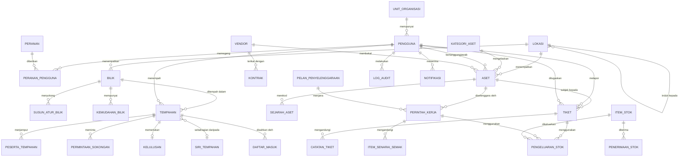

# 05 — DRD: Data Requirements Document

| Perkara | Butiran |
|---|---|
| Dokumen | Data Requirements Document (DRD) |
| Sistem | SPFA — Sistem Pengurusan Fasiliti & Aset ICT |
| Versi | 1.0 (Draf) |
| Tarikh | 7 September 2026 |

---

## 1. Tujuan Dokumen

Dokumen ini menyatakan data yang perlu disimpan oleh sistem, hubungan antara data tersebut, peraturan integriti, kaedah pemindahan data sedia ada, dan dasar penyimpanan. Ia adalah rujukan utama bagi pentadbir pangkalan data dan pembangun lapisan data.

## 2. Prinsip Data

1. **Satu sumber kebenaran.** Setiap fakta disimpan sekali sahaja. Kapasiti bilik disimpan pada bilik, bukan disalin ke setiap tempahan. Pengecualian dinyatakan secara eksplisit sebagai data petikan sejarah.
2. **Data sejarah tidak dipadam.** Rekod yang tidak lagi digunakan dinyahaktifkan, bukan dipadam. Ini memelihara integriti laporan sejarah.
3. **Petikan pada masa transaksi.** Nilai yang boleh berubah dan mempengaruhi rekod kewangan atau audit disalin ke rekod transaksi pada masa ia berlaku. Contohnya kos seunit alat ganti disalin ke rekod pengeluaran stok, kerana harga boleh berubah kemudian.
4. **Masa disimpan dalam UTC.** Paparan menukar kepada zon waktu tempatan. Ini mengelakkan ralat semasa peralihan waktu dan memudahkan perbandingan.
5. **Pengenal utama tidak bermakna.** Kunci utama adalah UUID atau integer berjujukan. Nombor pendaftaran aset dan nombor tiket adalah pengenal perniagaan yang berasingan daripada kunci utama.

## 3. Model Data Konseptual

## 4. Kamus Data

Jenis data ditulis secara neutral. Pemetaan kepada jenis khusus enjin pangkalan data dilakukan dalam SDD.

### 4.1 Entiti Asas

#### PENGGUNA
| Medan | Jenis | Wajib | Keterangan |
|---|---|---|---|
| id | UUID | Ya | Kunci utama |
| nama_pengguna | Teks 100 | Ya | Unik, daripada direktori organisasi |
| nama_penuh | Teks 200 | Ya | |
| emel | Teks 200 | Ya | Unik |
| telefon | Teks 30 | Tidak | |
| unit_organisasi_id | UUID | Ya | Rujukan UNIT_ORGANISASI |
| lokasi_id | UUID | Tidak | Lokasi kerja utama |
| jenis_akaun | Enum | Ya | direktori, tempatan |
| cincangan_kata_laluan | Teks 255 | Tidak | Hanya bagi akaun tempatan |
| bahasa_pilihan | Enum | Ya | ms, en. Lalai ms |
| aktif | Boolean | Ya | Lalai benar |
| dicipta_pada | Cap masa | Ya | |
| log_masuk_terakhir | Cap masa | Tidak | |

#### PERANAN dan PERANAN_PENGGUNA
| Medan | Jenis | Wajib | Keterangan |
|---|---|---|---|
| PERANAN.id | Integer | Ya | |
| PERANAN.kod | Teks 20 | Ya | R1 hingga R8 |
| PERANAN.nama | Teks 100 | Ya | |
| PERANAN_PENGGUNA.pengguna_id | UUID | Ya | |
| PERANAN_PENGGUNA.peranan_id | Integer | Ya | |
| PERANAN_PENGGUNA.skop_lokasi_id | UUID | Tidak | Mengehadkan peranan kepada satu bangunan atau kampus |

Kunci utama gabungan pada pengguna, peranan dan skop lokasi.

#### LOKASI
| Medan | Jenis | Wajib | Keterangan |
|---|---|---|---|
| id | UUID | Ya | |
| induk_id | UUID | Tidak | Rujukan kendiri, kosong bagi kampus |
| aras | Enum | Ya | kampus, bangunan, tingkat, ruang |
| kod | Teks 30 | Ya | Unik dalam induk yang sama |
| nama | Teks 150 | Ya | |
| aktif | Boolean | Ya | |

#### KONFIGURASI
| Medan | Jenis | Wajib | Keterangan |
|---|---|---|---|
| kunci | Teks 100 | Ya | Kunci utama |
| nilai | Teks panjang | Ya | Disimpan sebagai JSON |
| jenis_nilai | Enum | Ya | teks, nombor, boolean, json |
| keterangan | Teks 500 | Tidak | Dipaparkan dalam skrin pentadbiran |
| dikemas_kini_oleh | UUID | Ya | |
| dikemas_kini_pada | Cap masa | Ya | |

### 4.2 Domain A — Tempahan

#### BILIK
| Medan | Jenis | Wajib | Keterangan |
|---|---|---|---|
| id | UUID | Ya | |
| kod | Teks 30 | Ya | Unik |
| nama | Teks 150 | Ya | |
| lokasi_id | UUID | Ya | Mesti aras ruang |
| kapasiti_asas | Integer | Ya | Melebihi 0 |
| perlu_kelulusan | Boolean | Ya | Lalai palsu |
| peranan_dibenarkan | Senarai | Tidak | Kosong bermaksud semua peranan |
| tempoh_min_minit | Integer | Ya | Lalai 30 |
| tempoh_maks_minit | Integer | Ya | Lalai 480 |
| penyangga_sebelum_minit | Integer | Ya | Lalai 0 |
| penyangga_selepas_minit | Integer | Ya | Lalai 0 |
| waktu_buka | Masa | Ya | Lalai 08:00 |
| waktu_tutup | Masa | Ya | Lalai 18:00 |
| hari_operasi | Senarai | Ya | Lalai Isnin hingga Jumaat |
| kod_qr | Teks 100 | Tidak | Token unik untuk daftar masuk |
| aktif | Boolean | Ya | |

#### SUSUN_ATUR_BILIK
| Medan | Jenis | Wajib | Keterangan |
|---|---|---|---|
| id | UUID | Ya | |
| bilik_id | UUID | Ya | |
| jenis_susun_atur | Teks 50 | Ya | Daripada senarai rujukan |
| kapasiti | Integer | Ya | |
| lalai | Boolean | Ya | Satu sahaja lalai bagi setiap bilik |

#### TEMPAHAN
| Medan | Jenis | Wajib | Keterangan |
|---|---|---|---|
| id | UUID | Ya | |
| no_rujukan | Teks 20 | Ya | Unik, format TMP-YYYYMM-nnnnn |
| bilik_id | UUID | Ya | |
| siri_id | UUID | Tidak | Kosong bagi tempahan tunggal |
| penempah_id | UUID | Ya | Pengguna yang membuat tempahan |
| tuan_punya_id | UUID | Ya | Pemilik mesyuarat, biasanya sama dengan penempah |
| tajuk | Teks 200 | Ya | |
| keterangan | Teks panjang | Tidak | |
| masa_mula | Cap masa | Ya | UTC |
| masa_tamat | Cap masa | Ya | UTC, mesti selepas masa mula |
| bil_peserta | Integer | Ya | Melebihi 0 |
| susun_atur_id | UUID | Tidak | |
| status | Enum | Ya | draf, menunggu_kelulusan, disahkan, ditolak, daftar_masuk, selesai, dibatalkan, dilepaskan |
| sebab_batal | Teks 500 | Tidak | Wajib apabila status dibatalkan dan tempahan telah disahkan; pilihan bagi tempahan yang dibatalkan sebelum kelulususan |
| batal_lewat | Boolean | Ya | Benar jika dibatalkan kurang 2 jam sebelum mula |
| dicipta_pada | Cap masa | Ya | |
| dikemas_kini_pada | Cap masa | Ya | |

#### SIRI_TEMPAHAN
| Medan | Jenis | Wajib | Keterangan |
|---|---|---|---|
| id | UUID | Ya | |
| corak | Enum | Ya | harian, mingguan, bulanan |
| selang | Integer | Ya | Contohnya 2 bermaksud setiap dua minggu |
| hari_dalam_minggu | Senarai | Tidak | Bagi corak mingguan |
| tarikh_mula | Tarikh | Ya | |
| tarikh_tamat | Tarikh | Ya | |
| dicipta_oleh | UUID | Ya | |

#### PESERTA_TEMPAHAN
| Medan | Jenis | Wajib | Keterangan |
|---|---|---|---|
| tempahan_id | UUID | Ya | |
| pengguna_id | UUID | Tidak | Kosong bagi peserta luar |
| emel_luar | Teks 200 | Tidak | Wajib jika pengguna_id kosong |
| status_jemputan | Enum | Ya | dihantar, diterima, ditolak |

#### KELULUSAN
| Medan | Jenis | Wajib | Keterangan |
|---|---|---|---|
| id | UUID | Ya | |
| jenis_rekod | Enum | Ya | tempahan, pelupusan_aset |
| rekod_id | UUID | Ya | |
| aras | Integer | Ya | 1 atau 2 |
| pelulus_id | UUID | Ya | |
| pelulus_sebenar_id | UUID | Tidak | Diisi jika diluluskan oleh wakil |
| keputusan | Enum | Ya | menunggu, diluluskan, ditolak |
| sebab | Teks 500 | Tidak | Wajib apabila ditolak |
| tarikh_keputusan | Cap masa | Tidak | |

#### DAFTAR_MASUK
| Medan | Jenis | Wajib | Keterangan |
|---|---|---|---|
| id | UUID | Ya | |
| tempahan_id | UUID | Ya | |
| kaedah | Enum | Ya | qr, aplikasi, manual_pentadbir |
| masa_daftar | Cap masa | Ya | |
| oleh_pengguna_id | UUID | Ya | |

#### PERMINTAAN_SOKONGAN
| Medan | Jenis | Wajib | Keterangan |
|---|---|---|---|
| id | UUID | Ya | |
| tempahan_id | UUID | Ya | |
| jenis | Enum | Ya | susun_atur, minuman, sokongan_teknikal |
| butiran | Teks panjang | Tidak | |
| kuantiti | Integer | Tidak | |
| unit_bertanggungjawab_id | UUID | Ya | |
| status | Enum | Ya | baharu, dalam_tindakan, selesai, dibatalkan |

### 4.3 Domain B — Aset dan Penyelenggaraan

#### KATEGORI_ASET
| Medan | Jenis | Wajib | Keterangan |
|---|---|---|---|
| id | UUID | Ya | |
| kod | Teks 20 | Ya | Unik, contohnya KOMP, PRNT, RNGK |
| nama | Teks 100 | Ya | |
| induk_id | UUID | Tidak | Menyokong subkategori |
| jangka_hayat_tahun | Integer | Tidak | Untuk pengiraan susut nilai dan cadangan gantian |

#### ASET
| Medan | Jenis | Wajib | Keterangan |
|---|---|---|---|
| id | UUID | Ya | |
| no_pendaftaran | Teks 50 | Ya | Unik, tidak boleh diguna semula |
| kategori_id | UUID | Ya | |
| jenama | Teks 100 | Ya | |
| model | Teks 100 | Ya | |
| no_siri | Teks 100 | Tidak | Unik jika diisi |
| spesifikasi | JSON | Tidak | Medan berubah mengikut kategori |
| tarikh_perolehan | Tarikh | Ya | |
| harga_perolehan | Nombor perpuluhan | Tidak | |
| no_pesanan | Teks 50 | Tidak | Rujukan kepada sistem perolehan |
| vendor_pembekal_id | UUID | Tidak | |
| waranti_mula | Tarikh | Tidak | |
| waranti_bulan | Integer | Tidak | |
| lokasi_id | UUID | Ya | |
| pengguna_bertanggungjawab_id | UUID | Tidak | Kosong bagi aset dalam simpanan |
| status | Enum | Ya | simpanan, digunakan, dalam_pembaikan, tidak_aktif, dilupuskan |
| alamat_mac | Teks 20 | Tidak | |
| nama_hos | Teks 100 | Tidak | |
| kod_qr | Teks 100 | Ya | Token unik dalam URL label |
| catatan | Teks panjang | Tidak | |
| dicipta_pada | Cap masa | Ya | |

**Medan terbitan (tidak disimpan, dikira semasa paparan):** status waranti, umur aset, jumlah kos pembaikan terkumpul, bilangan tiket sepanjang hayat.

#### SEJARAH_ASET
| Medan | Jenis | Wajib | Keterangan |
|---|---|---|---|
| id | UUID | Ya | |
| aset_id | UUID | Ya | |
| jenis_peristiwa | Enum | Ya | didaftar, pindah_lokasi, tukar_pemilik, tukar_status, naik_taraf, dilupuskan |
| nilai_sebelum | JSON | Tidak | |
| nilai_selepas | JSON | Tidak | |
| sebab | Teks 500 | Tidak | |
| direkod_oleh | UUID | Ya | |
| direkod_pada | Cap masa | Ya | |

#### Pemetaan Pelaksanaan ASET dan SEJARAH_ASET (keputusan 9 September 2026)

Pelaksanaan Laravel mengikut konvensyen aplikasi sedia ada (`locations`, `reference_values`): kunci utama integer berjujukan, bukan UUID; nama jadual dan lajur dalam Bahasa Inggeris snake_case; nilai enum dalam Bahasa Melayu.

| Entiti DRD | Jadual pelaksanaan | Perbezaan utama daripada DRD |
|---|---|---|
| ASET | `assets` | `id` bigint; `no_pendaftaran` → `registration_number` varchar(50) unik tanpa penapis (DI-04); `kategori_id` → `category_id` FK ke `reference_values` (type `kategori_aset`); `no_siri` → `serial_number` unik nullable; `alamat_mac` → `mac_address`; `nama_hos` → `hostname`; lajur `ip_address` ditambah (FR-AST-04); `kod_qr` → `qr_code` token unik dijana semasa pendaftaran; `vendor_pembekal_id` ditangguhkan ke M12 |
| SEJARAH_ASET | `asset_histories` | `id` bigint; FK `asset_id` dengan cascadeOnDelete; `nilai_sebelum`/`nilai_selepas` → `before`/`after` JSON; `direkod_pada` → `created_at` |
| KATEGORI_ASET | `reference_values` (type `kategori_aset`) | Tiada jadual berdedikati; subkategori dan `jangka_hayat_tahun` disimpan dalam `metadata` JSON apabila M11 memerlukannya |

Indeks bagi FR-AST-10: `registration_number`, `serial_number`, `location_id`, `status`, `category_id`, `responsible_user_id`.

#### TIKET
| Medan | Jenis | Wajib | Keterangan |
|---|---|---|---|
| id | UUID | Ya | |
| no_tiket | Teks 20 | Ya | Unik, format TKT-YYYYMM-nnnnn |
| aset_id | UUID | Tidak | Kosong bagi masalah umum |
| lokasi_id | UUID | Ya | Lokasi masalah |
| pelapor_id | UUID | Ya | |
| kategori_masalah | Teks 50 | Ya | Daripada senarai rujukan |
| keterangan | Teks panjang | Ya | |
| keutamaan | Enum | Ya | P1, P2, P3, P4 |
| status | Enum | Ya | baharu, diagih, dalam_tindakan, menunggu_alat_ganti, menunggu_vendor, menunggu_pengesahan, ditutup, dibatalkan |
| juruteknik_id | UUID | Tidak | |
| vendor_id | UUID | Tidak | Diisi apabila dirujuk kepada vendor |
| no_rujukan_vendor | Teks 50 | Tidak | |
| diagnosis | Teks panjang | Tidak | |
| tindakan | Teks panjang | Tidak | |
| kos_pembaikan | Nombor perpuluhan | Tidak | |
| dalam_waranti | Boolean | Ya | Petikan pada masa tiket dibuka |
| masa_dibuka | Cap masa | Ya | |
| masa_tindak_balas_pertama | Cap masa | Tidak | |
| masa_kerja_selesai | Cap masa | Tidak | |
| masa_ditutup | Cap masa | Tidak | |
| sasaran_tindak_balas | Cap masa | Ya | Dikira semasa penciptaan |
| sasaran_pemulihan | Cap masa | Ya | Dikira semasa penciptaan |
| minit_jeda_sla | Integer | Ya | Terkumpul semasa status menunggu, lalai 0 |
| sla_dipatuhi | Boolean | Tidak | Dikira semasa penutupan |

#### CATATAN_TIKET
| Medan | Jenis | Wajib | Keterangan |
|---|---|---|---|
| id | UUID | Ya | |
| tiket_id | UUID | Ya | |
| pengguna_id | UUID | Ya | |
| catatan | Teks panjang | Ya | |
| boleh_dilihat_pelapor | Boolean | Ya | Lalai benar |
| lampiran | Senarai JSON | Tidak | Nama fail, saiz, laluan simpanan |
| dicipta_pada | Cap masa | Ya | |

#### PELAN_PENYELENGGARAAN dan PERINTAH_KERJA
| Medan | Jenis | Wajib | Keterangan |
|---|---|---|---|
| PELAN.id | UUID | Ya | |
| PELAN.nama | Teks 150 | Ya | |
| PELAN.kategori_aset_id | UUID | Tidak | Kosong jika senarai aset tertentu digunakan |
| PELAN.kekerapan | Enum | Ya | bulanan, suku_tahunan, setengah_tahunan, tahunan |
| PELAN.awalan_hari | Integer | Ya | Bilangan hari perintah kerja dijana sebelum tarikh sasaran |
| PELAN.senarai_semak | JSON | Ya | Senarai item tugas |
| PELAN.aktif | Boolean | Ya | |
| PK.id | UUID | Ya | |
| PK.no_perintah | Teks 20 | Ya | Unik, format PK-YYYYMM-nnnnn |
| PK.pelan_id | UUID | Ya | |
| PK.aset_id | UUID | Ya | |
| PK.tarikh_sasaran | Tarikh | Ya | |
| PK.juruteknik_id | UUID | Tidak | |
| PK.status | Enum | Ya | dijana, diagih, dalam_tindakan, selesai, dilangkau |
| PK.tarikh_selesai | Cap masa | Tidak | |
| PK.catatan | Teks panjang | Tidak | |

#### VENDOR dan KONTRAK
| Medan | Jenis | Wajib | Keterangan |
|---|---|---|---|
| VENDOR.id | UUID | Ya | |
| VENDOR.nama | Teks 200 | Ya | |
| VENDOR.no_pendaftaran_syarikat | Teks 50 | Tidak | |
| VENDOR.orang_hubungan | Teks 150 | Tidak | |
| VENDOR.telefon | Teks 30 | Tidak | |
| VENDOR.emel | Teks 200 | Tidak | |
| VENDOR.aktif | Boolean | Ya | |
| KONTRAK.id | UUID | Ya | |
| KONTRAK.vendor_id | UUID | Ya | |
| KONTRAK.no_kontrak | Teks 50 | Ya | |
| KONTRAK.tarikh_mula | Tarikh | Ya | |
| KONTRAK.tarikh_tamat | Tarikh | Ya | |
| KONTRAK.skop | Teks panjang | Tidak | |
| KONTRAK.nilai | Nombor perpuluhan | Tidak | |
| KONTRAK.lampiran | Senarai JSON | Tidak | |

#### ITEM_STOK, PENERIMAAN_STOK dan PENGELUARAN_STOK
| Medan | Jenis | Wajib | Keterangan |
|---|---|---|---|
| ITEM.id | UUID | Ya | |
| ITEM.kod | Teks 30 | Ya | Unik |
| ITEM.nama | Teks 150 | Ya | |
| ITEM.unit | Teks 20 | Ya | unit, kotak, meter |
| ITEM.paras_minimum | Integer | Ya | |
| ITEM.baki_semasa | Integer | Ya | Tidak boleh negatif |
| ITEM.lokasi_simpanan_id | UUID | Tidak | |
| TERIMA.id | UUID | Ya | |
| TERIMA.item_id | UUID | Ya | |
| TERIMA.kuantiti | Integer | Ya | Melebihi 0 |
| TERIMA.kos_seunit | Nombor perpuluhan | Tidak | |
| TERIMA.vendor_id | UUID | Tidak | |
| TERIMA.tarikh | Cap masa | Ya | |
| KELUAR.id | UUID | Ya | |
| KELUAR.item_id | UUID | Ya | |
| KELUAR.kuantiti | Integer | Ya | Melebihi 0 |
| KELUAR.tiket_id | UUID | Tidak | Salah satu daripada tiket atau perintah kerja wajib |
| KELUAR.perintah_kerja_id | UUID | Tidak | |
| KELUAR.kos_seunit_petikan | Nombor perpuluhan | Tidak | Disalin daripada penerimaan terkini |
| KELUAR.dikeluarkan_oleh | UUID | Ya | |
| KELUAR.tarikh | Cap masa | Ya | |

### 4.4 Entiti Sokongan

#### LOG_AUDIT
| Medan | Jenis | Wajib | Keterangan |
|---|---|---|---|
| id | UUID | Ya | |
| pengguna_id | UUID | Tidak | Kosong bagi tindakan sistem |
| alamat_ip | Teks 45 | Tidak | Menyokong IPv6 |
| jenis_rekod | Teks 50 | Ya | |
| rekod_id | Teks 50 | Ya | |
| tindakan | Enum | Ya | cipta, kemas_kini, padam, log_masuk, log_masuk_gagal, log_keluar |
| nilai_sebelum | JSON | Tidak | |
| nilai_selepas | JSON | Tidak | |
| berlaku_pada | Cap masa | Ya | |

#### NOTIFIKASI
| Medan | Jenis | Wajib | Keterangan |
|---|---|---|---|
| id | UUID | Ya | |
| penerima_id | UUID | Ya | |
| jenis_peristiwa | Teks 50 | Ya | |
| tajuk | Teks 200 | Ya | |
| kandungan | Teks panjang | Ya | |
| pautan | Teks 500 | Tidak | |
| saluran | Enum | Ya | dalam_aplikasi, emel |
| status_hantar | Enum | Ya | menunggu, dihantar, gagal |
| bilangan_cubaan | Integer | Ya | Lalai 0 |
| dibaca_pada | Cap masa | Tidak | |
| dicipta_pada | Cap masa | Ya | |

## 5. Peraturan Integriti Data

| ID | Peraturan | Penguatkuasaan |
|---|---|---|
| DI-01 | Tiada dua tempahan aktif bertindih pada bilik yang sama | Kekangan pengecualian pangkalan data pada julat masa, ditapis kepada status aktif |
| DI-02 | Masa tamat tempahan mesti selepas masa mula | Kekangan semakan |
| DI-03 | Bilangan peserta tidak melebihi kapasiti susun atur yang dipilih | Pengesahan aplikasi dan pencetus pangkalan data |
| DI-04 | Nombor pendaftaran aset unik merentas semua status termasuk dilupuskan | Indeks unik tanpa penapis |
| DI-05 | Baki stok tidak boleh negatif | Kekangan semakan dan kunci baris semasa pengeluaran |
| DI-06 | Pengeluaran stok mesti merujuk tepat satu daripada tiket atau perintah kerja | Kekangan semakan |
| DI-07 | Lokasi tidak boleh menjadi induk kepada dirinya sendiri secara langsung atau tidak langsung | Pengesahan aplikasi semasa penyimpanan |
| DI-08 | Sasaran pemulihan tiket mesti selepas sasaran tindak balas | Kekangan semakan |
| DI-09 | Aset berstatus dilupuskan tidak boleh dirujuk oleh tiket baharu | Pengesahan aplikasi |
| DI-10 | Setiap bilik mesti mempunyai sekurang-kurangnya satu susun atur lalai | Pengesahan aplikasi |
| DI-11 | Pemadaman rekod induk yang mempunyai rekod anak aktif ditolak | Kunci asing dengan tindakan sekat |

## 6. Isipadu Data dan Pertumbuhan

Anggaran bagi organisasi 500 kakitangan, 30 bilik mesyuarat dan 1,200 aset ICT.

| Entiti | Isipadu awal | Pertumbuhan tahunan | Isipadu selepas 5 tahun |
|---|---|---|---|
| Pengguna | 500 | 50 | 750 |
| Bilik | 30 | 3 | 45 |
| Tempahan | 0 | 18,000 | 90,000 |
| Peserta tempahan | 0 | 90,000 | 450,000 |
| Aset | 1,200 | 200 | 2,200 |
| Sejarah aset | 1,200 | 900 | 5,700 |
| Tiket | 0 | 2,400 | 12,000 |
| Catatan tiket | 0 | 9,600 | 48,000 |
| Perintah kerja | 0 | 4,800 | 24,000 |
| Log audit | 0 | 500,000 | 2,500,000 |

Jumlah storan pangkalan data dianggarkan bawah 20 gigabait selepas lima tahun, tidak termasuk lampiran fail. Lampiran foto tiket dianggarkan 2 gigabait setahun dan disimpan di luar pangkalan data.

## 7. Dasar Penyimpanan dan Pengarkiban

| Data | Tempoh simpanan aktif | Tindakan selepas itu |
|---|---|---|
| Tempahan | 3 tahun | Diarkib ke jadual sejarah, boleh dicapai melalui laporan |
| Tiket dan catatan | 5 tahun | Diarkib |
| Sejarah aset | Sepanjang hayat aset campur 7 tahun | Kekal, keperluan audit aset |
| Log audit | 3 tahun dalam talian | Dieksport ke storan sejuk, disimpan 7 tahun |
| Notifikasi | 6 bulan | Dipadam |
| Lampiran fail tiket | 3 tahun | Dipadam bersama tiket yang diarkib |
| Data pengguna yang telah berhenti | Dinyahaktifkan serta-merta | Data peribadi ditanpanamakan selepas 3 tahun, rekod transaksi dikekalkan |

## 8. Migrasi Data

### 8.1 Sumber data sedia ada

| Sumber | Kandungan | Kualiti dijangka |
|---|---|---|
| Fail Excel inventori ICT | Kira-kira 1,200 baris aset | Sederhana. Nombor siri tidak lengkap, lokasi dalam teks bebas |
| Senarai bilik dalam dokumen Word | 30 bilik | Baik, tetapi kapasiti perlu disahkan semula |
| Direktori pengguna organisasi | 500 pengguna | Baik |
| Buku log tempahan | Tempahan lepas | Tidak dimigrasikan. Nilai sejarah rendah berbanding usaha |

### 8.2 Pendekatan migrasi

1. **Pembersihan sebelum import.** Pegawai aset membersihkan fail Excel menggunakan templat yang disediakan. Lajur lokasi dipetakan kepada kod lokasi sistem, bukan teks bebas.
2. **Import percubaan ke persekitaran ujian.** Laporan ralat dikeluarkan baris demi baris. Baris gagal diperbaiki dalam fail sumber, bukan dalam pangkalan data.
3. **Import sebenar** dilakukan sekali sahaja sebelum go-live, dengan sandaran penuh sebelum dan selepas.
4. **Pengesahan selepas import.** Jumlah rekod dibandingkan, sampel 50 aset disemak secara fizikal terhadap rekod sistem.

### 8.3 Peraturan pemetaan aset

| Medan sumber | Medan sasaran | Peraturan |
|---|---|---|
| No. Aset | no_pendaftaran | Wajib. Baris tanpa nilai ditolak |
| Jenis | kategori_id | Dipetakan melalui jadual pemetaan. Nilai tidak dikenali ditolak |
| Lokasi (teks) | lokasi_id | Dipetakan melalui jadual pemetaan yang disediakan pegawai aset |
| Pengguna | pengguna_bertanggungjawab_id | Dipadan dengan nama pengguna direktori. Padanan tidak pasti ditandakan untuk semakan manual |
| Tarikh Beli | tarikh_perolehan | Format dinormalkan. Nilai tidak sah menjadi kosong dengan amaran |
| Status | status | Nilai kosong menjadi digunakan jika ada pengguna, simpanan jika tiada |

## 9. Sandaran dan Pemulihan

| Perkara | Keperluan |
|---|---|
| Sandaran penuh | Setiap hari pada waktu luar pejabat, disimpan 30 hari |
| Sandaran tambahan | Setiap jam bagi log transaksi |
| Lokasi sandaran | Sekurang-kurangnya satu salinan di luar tapak |
| Ujian pemulihan | Setiap suku tahun, ke persekitaran ujian, dengan laporan bertulis |
| Sasaran masa pemulihan | 4 jam |
| Sasaran titik pemulihan | 1 jam |

## 10. Perlindungan Data Peribadi

Data peribadi dalam sistem ini terhad kepada nama, e-mel rasmi, nombor telefon pejabat dan unit organisasi. Tiada data sensitif seperti nombor kad pengenalan atau maklumat kewangan peribadi disimpan.

| Keperluan | Pelaksanaan |
|---|---|
| Minimum data | Hanya medan yang diperlukan untuk operasi dikumpul |
| Kawalan capaian | Data peribadi pengguna lain hanya boleh dilihat oleh peranan yang memerlukannya |
| Hak akses subjek data | Pengguna boleh melihat dan mengeksport data peribadi sendiri |
| Penanpanamaan | Selepas tempoh simpanan, nama dan e-mel digantikan dengan pengenal tanpa nama, rekod transaksi dikekalkan untuk statistik |
| Penyulitan semasa penghantaran | Sambungan TLS wajib |
| Penyulitan semasa simpanan | Penyulitan pada aras cakera atau pangkalan data |
