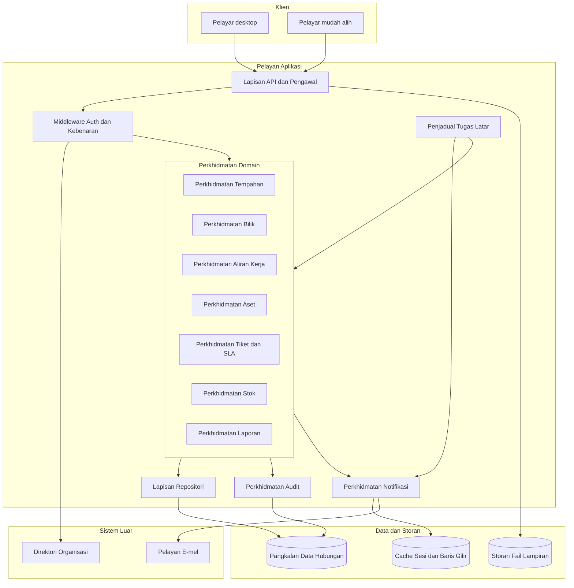
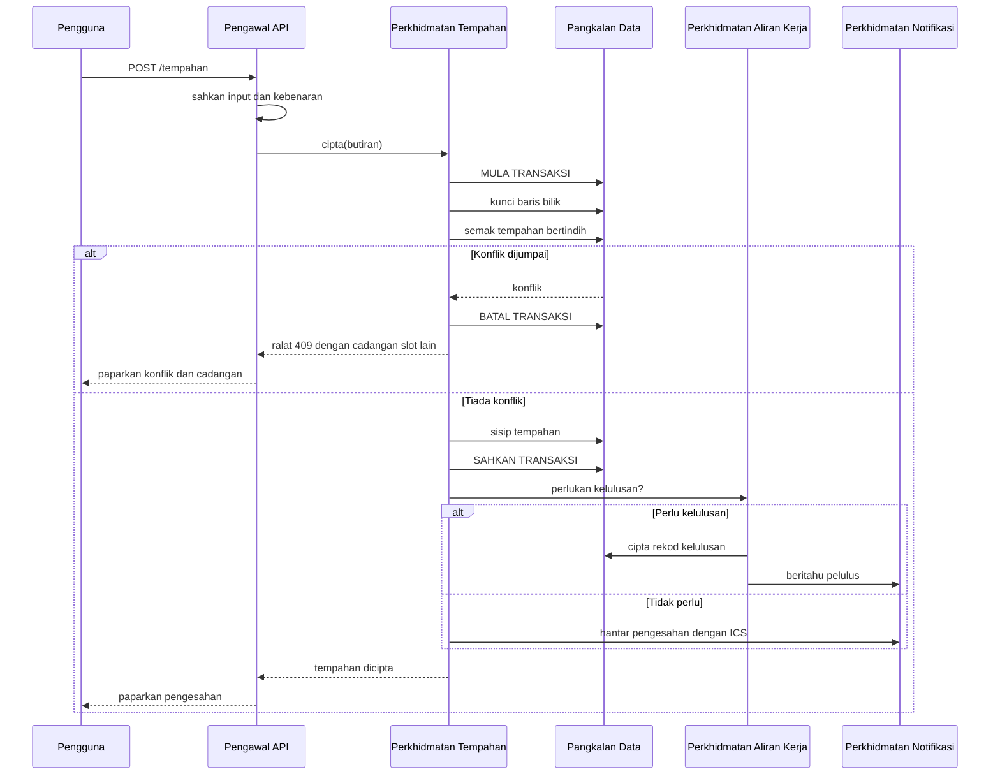

# 06 — SDD: System Design Document

| Perkara | Butiran |
|---|---|
| Dokumen | System Design Document (SDD) |
| Sistem | SPFA — Sistem Pengurusan Fasiliti & Aset ICT |
| Versi | 1.0 (Draf) |
| Tarikh | 7 September 2026 |

---

## 1. Tujuan dan Skop

Dokumen ini menerangkan bagaimana sistem dibina untuk memenuhi keperluan dalam SRS. Ia menyatakan pilihan seni bina beserta sebabnya, komponen utama, aliran data, pengendalian ralat, dan strategi penggunaan. Pilihan teknologi khusus adalah cadangan; yang mengikat adalah sifat seni bina yang dinyatakan.

## 2. Prinsip Reka Bentuk

1. **Domain terpisah, platform berkongsi.** Domain tempahan dan domain penyelenggaraan berkongsi pengguna, lokasi, notifikasi dan audit, tetapi logik perniagaannya tidak saling bergantung. Satu domain boleh dibangunkan, diuji dan dilepaskan tanpa menyentuh yang lain.
2. **Peraturan perniagaan di satu tempat.** Setiap peraturan seperti pengesanan konflik atau pengiraan SLA dilaksanakan dalam satu perkhidmatan domain, bukan diulang dalam pengawal, antara muka dan laporan.
3. **Integriti kritikal dikuatkuasakan oleh pangkalan data.** Peraturan yang tidak boleh dilanggar walaupun dalam keadaan perlumbaan diletakkan sebagai kekangan pangkalan data, bukan semakan aplikasi sahaja.
4. **Mudah dahulu.** Sistem ini melayani ratusan pengguna, bukan jutaan. Aplikasi tunggal yang tersusun baik lebih sesuai daripada perkhidmatan mikro. Kerumitan pengedaran tidak berbaloi pada skala ini.
5. **Fail besar adalah tanda amaran.** Apabila satu fail melebihi kira-kira 400 baris, ia biasanya memikul lebih daripada satu tanggungjawab dan patut dipecahkan.

## 3. Seni Bina Aras Tinggi



## 4. Cadangan Timbunan Teknologi

Dua pilihan dikemukakan. Pilihan pertama adalah cadangan utama.

### Pilihan A — Laravel dan PostgreSQL (disyorkan)

| Lapisan | Teknologi | Sebab |
|---|---|---|
| Bahagian belakang | PHP 8.3 dengan Laravel 11 | Kerangka matang untuk aplikasi perniagaan dalaman. Penjadual tugas, baris gilir, migrasi pangkalan data, pengesahan dan kebenaran tersedia terbina dalam. Kolam bakat tempatan luas. |
| Pangkalan data | PostgreSQL 16 | Menyokong jenis julat dan kekangan pengecualian, yang menyelesaikan masalah pertindihan tempahan pada aras pangkalan data. Ini adalah faktor penentu. |
| Bahagian hadapan | Blade dengan Livewire atau Inertia dengan Vue 3 | Mengelakkan pembinaan dua aplikasi berasingan. Sesuai untuk borang dan jadual yang mendominasi sistem ini. |
| Cache dan baris gilir | Redis | Sesi, cache carian bilik, dan baris gilir e-mel |
| Storan fail | Sistem fail tempatan atau storan objek serasi S3 | Lampiran tiket dan foto bilik |
| Laporan PDF | Pustaka penjanaan PDF sisi pelayan | Eksport laporan |

**Sebab utama memilih PostgreSQL.** Keperluan FR-TMP-04 menghendaki dua permintaan tempahan serentak untuk slot yang sama tidak boleh kedua-duanya berjaya. PostgreSQL menyediakan `EXCLUDE USING gist` ke atas jenis julat masa, yang menguatkuasakan ini pada aras enjin pangkalan data. Pada pangkalan data lain, penyelesaian yang setara memerlukan kunci eksplisit yang lebih mudah tersilap laksana.

### Pilihan B — .NET dan SQL Server

Sesuai jika organisasi sudah mempunyai pelaburan besar dalam ekosistem Microsoft, termasuk Active Directory, lesen SQL Server dan kepakaran dalaman .NET. Pengesanan konflik dilaksanakan menggunakan aras pengasingan bersiri atau kunci gunaan. Kos lesen lebih tinggi tetapi integrasi direktori lebih lancar.

### Perkara yang mengikat tanpa mengira pilihan

- Pangkalan data hubungan dengan sokongan transaksi penuh. Pangkalan data dokumen tidak sesuai kerana data ini sangat berhubung.
- Pengesanan konflik tempahan mesti dikuatkuasakan pada aras pangkalan data.
- Penjadual tugas latar diperlukan untuk peringatan, pelepasan automatik, penjanaan perintah kerja dan amaran SLA.
- Antara muka mesti responsif tanpa aplikasi natif berasingan.

## 5. Komponen dan Tanggungjawab

### 5.1 Perkhidmatan Tempahan

Tanggungjawab tunggal: mengurus kitaran hayat tempahan.

**Operasi awam:**

| Operasi | Input | Output | Kesan sampingan |
|---|---|---|---|
| cariBilikTersedia | julat masa, penapis | senarai bilik | tiada |
| ciptaTempahan | butiran tempahan | tempahan atau ralat konflik | rekod tempahan, permulaan aliran kelulusan, notifikasi |
| ubahTempahan | id, perubahan | tempahan dikemas kini | semakan konflik semula, notifikasi |
| batalTempahan | id, sebab (pilihan sebelum kelulususan)| tempahan dibatalkan |notifikasi, pembatalan permintaan sokongan, penarikan balik permohonan kelulususan menunggu |

**Aliran penciptaan tempahan:**



### 5.2 Perkhidmatan Tiket dan SLA

Tanggungjawab tunggal: mengurus kitaran hayat tiket dan pengiraan masa SLA.

Pengiraan SLA diasingkan ke dalam kelas kalkulator tersendiri kerana ia mengandungi logik kalendar yang rumit: waktu bekerja, cuti umum, dan tempoh jeda semasa menunggu vendor atau alat ganti. Kelas ini menerima jadual waktu bekerja sebagai input dan tidak menyentuh pangkalan data, jadi ia boleh diuji secara menyeluruh dengan ujian unit tanpa persediaan data.

```
KalkulatorSLA
  .kiraSasaran(masa_mula, keutamaan, kalendar) -> masa_sasaran
  .kiraMasaBerlalu(masa_mula, masa_tamat, minit_jeda, kalendar) -> minit_bekerja
  .peratusanTerpakai(tiket, masa_sekarang) -> peratus
```

### 5.3 Penjadual Tugas Latar

| Tugas | Kekerapan | Tindakan |
|---|---|---|
| Peringatan tempahan | Setiap 5 minit | Hantar peringatan bagi tempahan dalam tetingkap peringatan |
| Amaran daftar masuk | Setiap minit | Hantar amaran bagi tempahan yang bermula tetapi belum daftar masuk |
| Pelepasan automatik | Setiap minit | Lepaskan tempahan melepasi tempoh anjal |
| Semakan ambang SLA | Setiap 10 minit | Kesan tiket pada 80% dan 100% sasaran, hantar amaran |
| Penutupan tiket automatik | Harian | Tutup tiket menunggu pengesahan melebihi tiga hari bekerja |
| Penjanaan perintah kerja | Harian | Jana perintah kerja preventif mengikut tempoh awalan pelan |
| Amaran waranti dan kontrak | Harian | Hantar amaran 90, 30 dan 7 hari sebelum tamat |
| Amaran paras stok | Harian | Semak item bawah paras minimum |
| Percubaan semula e-mel gagal | Setiap 15 minit | Cuba semula notifikasi berstatus gagal sehingga tiga kali |
| Pengarkiban | Bulanan | Pindahkan rekod melepasi tempoh simpanan aktif |

Setiap tugas mesti selamat untuk dijalankan berulang. Jika penjadual berjalan dua kali kerana pemulihan sistem, kesannya mesti sama seperti sekali. Ini dicapai dengan menyemak status rekod sebelum bertindak, bukan bergantung kepada masa larian.

### 5.4 Perkhidmatan Notifikasi

Semua penghantaran keluar melalui satu perkhidmatan. Modul lain menghantar peristiwa, bukan e-mel. Ini bermakna menambah saluran baharu seperti Teams hanya menyentuh satu modul.

```
NotifyService.hantar(jenis_peristiwa, penerima, data_konteks)
  -> pilih templat mengikut jenis peristiwa dan bahasa penerima
  -> gantikan pemegang tempat dengan data konteks
  -> masukkan ke baris gilir mengikut saluran
  -> pekerja baris gilir menghantar dan mengemas kini status
```

Kegagalan penghantaran e-mel tidak boleh menggagalkan transaksi perniagaan. Tempahan yang berjaya kekal berjaya walaupun e-mel pengesahan gagal dihantar; kegagalan direkod dan dicuba semula.

## 6. Reka Bentuk Pangkalan Data

### 6.1 Kekangan pengesanan konflik

Pada PostgreSQL, jadual tempahan menggunakan lajur julat masa terbitan dan kekangan pengecualian:

```sql
ALTER TABLE tempahan ADD COLUMN julat_masa tstzrange
  GENERATED ALWAYS AS (tstzrange(masa_mula, masa_tamat, '[)')) STORED;

ALTER TABLE tempahan ADD CONSTRAINT tiada_pertindihan
  EXCLUDE USING gist (
    bilik_id WITH =,
    julat_masa WITH &&
  ) WHERE (status IN ('disahkan','menunggu_kelulusan','daftar_masuk'));
```

Kekangan ini bermakna dua permintaan serentak tidak mungkin kedua-duanya berjaya. Aplikasi menangkap ralat pelanggaran kekangan dan menukarkannya kepada respons konflik yang bermakna kepada pengguna, lengkap dengan cadangan slot alternatif.

Tempoh penyangga bilik ditambah ke dalam julat semasa penyisipan, supaya penyangga turut dilindungi oleh kekangan yang sama.

### 6.2 Indeks utama

| Jadual | Indeks | Tujuan |
|---|---|---|
| tempahan | (bilik_id, masa_mula) | Carian ketersediaan dan paparan kalendar |
| tempahan | (penempah_id, masa_mula desc) | Halaman tempahan saya |
| tempahan | (status, masa_mula) | Tugas latar peringatan dan pelepasan |
| aset | (no_pendaftaran) unik | Carian utama |
| aset | (kod_qr) unik | Pencarian melalui imbasan |
| aset | (lokasi_id, status) | Laporan inventori mengikut lokasi |
| tiket | (status, sasaran_pemulihan) | Pemantauan SLA |
| tiket | (juruteknik_id, status) | Senarai tugas juruteknik |
| tiket | (aset_id, masa_dibuka desc) | Sejarah tiket pada halaman aset |
| log_audit | (jenis_rekod, rekod_id, berlaku_pada desc) | Carian audit |
| log_audit | (berlaku_pada) | Pengarkiban |

### 6.3 Strategi pertumbuhan jadual audit

Jadual log audit tumbuh paling cepat. Ia dipartisi mengikut bulan. Partisi melebihi tempoh simpanan dalam talian dieksport dan digugurkan, yang jauh lebih pantas daripada memadam baris demi baris.

## 7. Reka Bentuk API

Prinsip: REST dengan kata nama jamak, kata kerja HTTP standard, dan respons JSON yang konsisten. Butiran endpoint terdapat dalam dokumen 09.

**Struktur respons ralat seragam:**

```json
{
  "ralat": {
    "kod": "TEMPAHAN_KONFLIK",
    "mesej": "Bilik ini telah ditempah pada masa tersebut.",
    "butiran": {
      "tempahan_bertindih": ["TMP-202609-00123"],
      "cadangan_slot": [
        {"mula": "2026-09-10T09:00:00Z", "tamat": "2026-09-10T10:00:00Z"}
      ]
    }
  }
}
```

Mesej ralat ditulis untuk dibaca pengguna akhir dalam Bahasa Melayu. Kod ralat kekal dalam bahasa Inggeris untuk kegunaan program.

## 8. Pengendalian Ralat

| Kategori | Contoh | Pengendalian |
|---|---|---|
| Ralat pengesahan input | Medan wajib kosong, format tarikh salah | Kod 422 dengan senarai ralat per medan, dipaparkan bersebelahan medan berkenaan |
| Pelanggaran peraturan perniagaan | Tempahan bertindih, kapasiti melebihi | Kod 409 atau 422 dengan mesej yang menerangkan peraturan dan cadangan tindakan |
| Kebenaran ditolak | Pengguna cuba melihat tiket orang lain | Kod 403 dengan mesej umum, butiran direkod dalam log audit |
| Rekod tidak dijumpai | Pautan lama kepada tempahan yang dipadam | Kod 404 dengan pautan kembali ke senarai |
| Kegagalan sistem luar | Pelayan e-mel tidak dapat dihubungi | Transaksi perniagaan diteruskan, penghantaran dibaris gilir, ralat direkod |
| Ralat tidak dijangka | Pengecualian tidak dikendalikan | Kod 500 dengan pengenal insiden yang boleh dirujuk kepada meja bantuan, butiran penuh dalam log pelayan sahaja |

Mesej ralat tidak boleh mendedahkan struktur dalaman sistem, nama jadual, atau surih tindanan kepada pengguna.

## 9. Strategi Pengujian

| Aras | Skop | Liputan sasaran |
|---|---|---|
| Ujian unit | Perkhidmatan domain, terutamanya pengesanan konflik dan kalkulator SLA | Melebihi 80% bagi logik domain |
| Ujian integrasi | Aliran melalui pengawal hingga pangkalan data, termasuk kekangan | Semua aliran utama setiap modul |
| Ujian keserentakan | Dua permintaan tempahan serentak untuk slot yang sama | Wajib lulus sebelum penerimaan |
| Ujian antara muka | Aliran utama pada pelayar desktop dan mudah alih | Sepuluh aliran kritikal |
| Ujian beban | 100 pengguna serentak melakukan carian dan tempahan | Memenuhi sasaran prestasi dalam NFR |
| Ujian penerimaan pengguna | Skrip dalam dokumen 12 | Semua skrip lulus |

Ujian keserentakan disenaraikan secara eksplisit kerana ia adalah ujian yang paling kerap terlepas dan paling mahal apabila gagal dalam pengeluaran.

## 10. Penggunaan dan Persekitaran

### 10.1 Persekitaran

| Persekitaran | Tujuan | Data |
|---|---|---|
| Pembangunan | Kerja harian pembangun | Data contoh yang dijana |
| Ujian | Ujian integrasi dan ujian penerimaan | Salinan data pengeluaran yang ditanpanamakan |
| Pementasan | Simulasi pengeluaran sebelum pelepasan | Sama seperti pengeluaran |
| Pengeluaran | Kegunaan sebenar | Data sebenar |

### 10.2 Topologi pengeluaran

Konfigurasi asas mencukupi untuk skala yang dianggarkan:

- Satu pelayan aplikasi dengan pengimbang beban di hadapannya, disediakan untuk penambahan pelayan kedua tanpa perubahan kod. Ini bermakna sesi disimpan dalam Redis, bukan dalam ingatan pelayan.
- Satu pelayan pangkalan data dengan replika sedia siaga yang dikemas kini secara berterusan.
- Satu proses pekerja baris gilir yang berasingan daripada pelayan web, supaya penghantaran e-mel yang perlahan tidak melambatkan permintaan pengguna.
- Storan fail berasingan daripada pelayan aplikasi.

### 10.3 Keperluan perkakasan minimum

| Komponen | Spesifikasi |
|---|---|
| Pelayan aplikasi | 4 vCPU, 8 GB RAM, 100 GB cakera |
| Pelayan pangkalan data | 4 vCPU, 16 GB RAM, 200 GB cakera SSD |
| Redis | 2 vCPU, 4 GB RAM |
| Storan fail | 500 GB, boleh dikembangkan |

### 10.4 Proses pelepasan

1. Kod digabungkan ke cabang utama hanya selepas semua ujian automatik lulus.
2. Pelepasan ke pementasan dilakukan secara automatik.
3. Ujian asap dijalankan pada pementasan.
4. Pelepasan ke pengeluaran memerlukan kelulusan bertulis pengurus projek.
5. Migrasi pangkalan data dijalankan sebelum kod baharu diaktifkan, dan mesti serasi ke belakang supaya pengunduran boleh dilakukan.
6. Rancangan pengunduran disediakan untuk setiap pelepasan.

## 11. Pemantauan dan Kebolehselenggaraan

| Perkara dipantau | Ambang amaran |
|---|---|
| Masa tindak balas purata API | Melebihi 1 saat selama 5 minit |
| Kadar ralat 500 | Melebihi 1% permintaan |
| Panjang baris gilir e-mel | Melebihi 500 mesej |
| Ruang cakera pangkalan data | Kurang 20% baki |
| Kegagalan tugas latar | Sebarang kegagalan |
| Sambungan pangkalan data | Melebihi 80% had kolam |

Log aplikasi disimpan berstruktur dalam format JSON supaya boleh dicari. Setiap permintaan diberi pengenal jejak yang muncul dalam semua log berkaitan dan dalam mesej ralat yang dipaparkan kepada pengguna.
