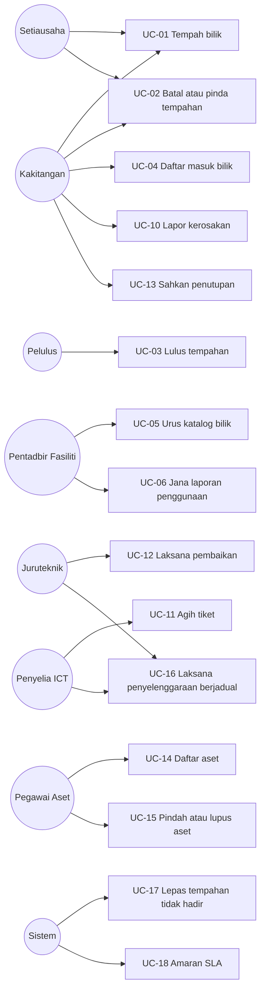
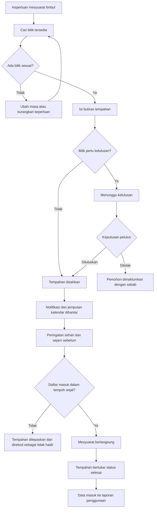
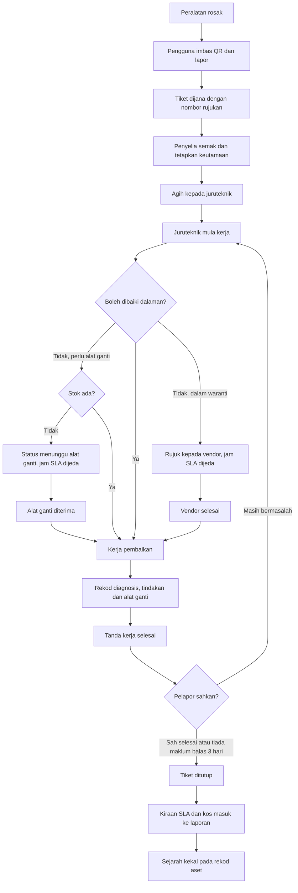

# 07 — Use Case & Proses Perniagaan

| Perkara | Butiran |
|---|---|
| Dokumen | Use Case Specification |
| Sistem | SPFA — Sistem Pengurusan Fasiliti & Aset ICT |
| Versi | 1.0 (Draf) |
| Tarikh | 7 September 2026 |

---

## 1. Rajah Use Case

---

## 2. Use Case Terperinci

### UC-01 Tempah Bilik Mesyuarat

| Perkara | Butiran |
|---|---|
| Pelaku utama | Kakitangan, Setiausaha |
| Pemegang kepentingan | Pentadbir fasiliti, peserta mesyuarat |
| Prasyarat | Pengguna telah log masuk dan mempunyai peranan yang dibenarkan menempah |
| Pencetus | Pengguna memerlukan bilik untuk mesyuarat |
| Jaminan minimum | Tiada tempahan separa tercipta; jika gagal, tiada rekod ditinggalkan |
| Jaminan kejayaan | Tempahan wujud dengan status disahkan atau menunggu kelulusan, dan notifikasi dihantar |
| Rujukan FR | FR-TMP-01 hingga FR-TMP-09 |

**Aliran utama:**

1. Pengguna membuka skrin tempahan baharu.
2. Pengguna memasukkan tarikh, masa mula dan tempoh.
3. Pengguna menetapkan penapis pilihan: kapasiti minimum, bangunan, kemudahan.
4. Sistem memaparkan senarai bilik yang tersedia beserta kapasiti dan kemudahan setiap satu.
5. Pengguna memilih satu bilik.
6. Pengguna memasukkan tajuk mesyuarat dan bilangan peserta.
7. Pengguna menambah peserta secara pilihan.
8. Pengguna menghantar permohonan.
9. Sistem mengesahkan semua peraturan tempahan.
10. Sistem menyimpan tempahan dengan status disahkan.
11. Sistem menghantar e-mel pengesahan dengan lampiran kalendar kepada penempah dan peserta.
12. Sistem memaparkan nombor rujukan tempahan.

**Aliran alternatif:**

- **9a. Bilik memerlukan kelulusan.** Sistem menyimpan tempahan dengan status menunggu kelulusan, menghantar notifikasi kepada pelulus, dan memaklumkan pengguna bahawa tempahan menunggu kelulusan. Aliran bersambung ke UC-03.
- **9b. Bilangan peserta melebihi kapasiti.** Sistem menolak dan mencadangkan bilik lain yang mencukupi kapasiti pada masa yang sama.
- **9c. Pengguna menempah bagi pihak orang lain.** Sistem merekod penempah dan tuan punya secara berasingan, dan menghantar notifikasi kepada kedua-duanya.

**Aliran pengecualian:**

- **10a. Konflik dikesan semasa penyimpanan.** Satu lagi pengguna menempah slot yang sama beberapa saat lebih awal. Sistem membatalkan transaksi, memaklumkan konflik, dan memaparkan tiga slot alternatif terdekat pada bilik yang sama serta bilik lain yang serupa pada masa asal.
- **11a. Penghantaran e-mel gagal.** Tempahan kekal sah. Sistem membariskan semula penghantaran dan memaparkan notifikasi dalam aplikasi.

---

### UC-02 Batal atau Pinda Tempahan

| Perkara | Butiran |
|---|---|
| Pelaku utama | Penempah, tuan punya tempahan, pentadbir fasiliti |
| Prasyarat | Tempahan wujud dan masa mula belum berlalu |
| Jaminan kejayaan | Status tempahan dikemas kini dan semua pihak terjejas dimaklumkan |
| Rujukan FR | FR-TMP-12 hingga FR-TMP-14 |

**Aliran utama pembatalan:**

1. Pengguna membuka tempahan daripada senarai tempahan saya.
2. Pengguna memilih batal.
3. Sistem meminta sebab pembatalan jika kurang daripada dua jam sebelum masa mula.
4. Pengguna mengesahkan.
5. Sistem menukar status kepada dibatalkan dan menandakan pembatalan lewat jika berkenaan.
6. Sistem membatalkan semua permintaan sokongan berkaitan.
7. Sistem menghantar notifikasi pembatalan kepada peserta.

**Aliran utama pindaan:**

1. Pengguna memilih ubah pada tempahan.
2. Pengguna mengubah masa atau bilik.
3. Sistem menjalankan semakan konflik yang sama seperti tempahan baharu.
4. Jika bilik yang baharu memerlukan kelulusan, tempahan kembali kepada status menunggu kelulusan.
5. Sistem menghantar notifikasi perubahan kepada semua peserta.

**Aliran alternatif:**

- **2a. Tempahan adalah sebahagian daripada siri berulang.** Sistem bertanya sama ada tindakan dikenakan kepada kejadian ini sahaja, kejadian ini dan selepasnya, atau seluruh siri.
- **3a. Tempahan berstatus menunggu kelulususan.** Sistem membatalkan tempahan serta-merta tanpa menunggu keputusan pelulus dan tanpa meminta sebab, memaklumkan pelulus bahawa permohonan telah ditarik balik, dan membebaskan slot untuk kegunaan lain.

---

### UC-03 Meluluskan Tempahan

| Perkara | Butiran |
|---|---|
| Pelaku utama | Pelulus |
| Prasyarat | Terdapat tempahan berstatus menunggu kelulusan dalam skop pelulus |
| Jaminan kejayaan | Keputusan direkod dan pemohon dimaklumkan |
| Rujukan FR | FR-KLS-01 hingga FR-KLS-06 |

**Aliran utama:**

1. Pelulus menerima notifikasi e-mel dan dalam aplikasi.
2. Pelulus membuka senarai tugas kelulusan.
3. Sistem memaparkan permohonan menunggu dengan pemohon, bilik, masa, tajuk dan bilangan peserta.
4. Pelulus memilih lulus.
5. Sistem menukar status tempahan kepada disahkan.
6. Sistem menghantar e-mel pengesahan dengan lampiran kalendar kepada pemohon dan peserta.

**Aliran alternatif:**

- **4a. Pelulus menolak.** Sistem meminta sebab wajib, menukar status kepada ditolak, dan menghantar sebab kepada pemohon.
- **4b. Pelulus tiada.** Sistem menghalakan permohonan kepada wakil yang telah ditetapkan dalam tempoh ketiadaan.
- **4c. Pelulus meluluskan beberapa permohonan sekaligus.** Sistem memproses setiap satu dan melaporkan mana-mana yang gagal.

**Aliran pengecualian:**

- **5a. Slot masa telah diambil oleh tempahan lain yang tidak memerlukan kelulusan.** Sistem memaklumkan pelulus bahawa slot tidak lagi tersedia dan mencadangkan penolakan dengan sebab automatik.

---

### UC-04 Daftar Masuk Bilik

| Perkara | Butiran |
|---|---|
| Pelaku utama | Penempah |
| Prasyarat | Tempahan berstatus disahkan dan berada dalam tetingkap daftar masuk |
| Jaminan kejayaan | Tempahan ditandakan sebagai digunakan dan tidak akan dilepaskan |
| Rujukan FR | FR-CHK-01 hingga FR-CHK-04 |

**Aliran utama:**

1. Penempah tiba di bilik dan mengimbas kod QR di pintu menggunakan kamera telefon.
2. Sistem membuka halaman bilik yang memaparkan tempahan semasa.
3. Penempah menekan butang daftar masuk.
4. Sistem mengesahkan identiti penempah dan tetingkap masa.
5. Sistem merekod daftar masuk dan menukar status tempahan.

**Aliran alternatif:**

- **1a. Penempah mendaftar masuk melalui aplikasi tanpa mengimbas.** Dibenarkan bermula sepuluh minit sebelum masa mula.
- **4a. Pengguna yang mengimbas bukan penempah atau peserta.** Sistem memaparkan maklumat tempahan tetapi tidak membenarkan daftar masuk.

---

### UC-10 Lapor Kerosakan Peralatan ICT

| Perkara | Butiran |
|---|---|
| Pelaku utama | Kakitangan |
| Prasyarat | Pengguna telah log masuk |
| Jaminan minimum | Tiada tiket separa tercipta |
| Jaminan kejayaan | Tiket wujud dengan nombor rujukan dan penyelia dimaklumkan |
| Rujukan FR | FR-TKT-01 hingga FR-TKT-07 |

**Aliran utama:**

1. Pengguna memilih lapor kerosakan.
2. Pengguna mengimbas kod QR pada peralatan.
3. Sistem memaparkan maklumat aset dan mengisinya ke dalam borang.
4. Pengguna memilih kategori masalah daripada senarai.
5. Pengguna menaip keterangan masalah.
6. Pengguna memuat naik foto secara pilihan.
7. Pengguna menghantar.
8. Sistem menjana nombor tiket, menetapkan keutamaan lalai mengikut kategori, dan mengira sasaran SLA.
9. Sistem menyimpan status waranti aset sebagai petikan pada rekod tiket.
10. Sistem memaparkan nombor tiket dan menghantar e-mel pengesahan.
11. Sistem menghantar notifikasi kepada penyelia ICT.

**Aliran alternatif:**

- **2a. Tiada kod QR atau imbasan gagal.** Pengguna mencari aset melalui nombor pendaftaran, atau memilih daripada senarai aset yang didaftarkan atas namanya.
- **2b. Masalah tidak berkaitan aset tertentu.** Pengguna memilih lapor masalah umum dan menetapkan lokasi sahaja.

**Aliran pengecualian:**

- **3a. Aset berstatus dilupuskan.** Sistem menolak dan meminta pengguna menghubungi pegawai aset kerana rekod tidak selaras dengan keadaan sebenar.

---

### UC-11 Agih Tiket kepada Juruteknik

| Perkara | Butiran |
|---|---|
| Pelaku utama | Penyelia ICT |
| Prasyarat | Terdapat tiket berstatus baharu |
| Jaminan kejayaan | Tiket mempunyai juruteknik bertanggungjawab dan juruteknik dimaklumkan |
| Rujukan FR | FR-TKT-08 hingga FR-TKT-11 |

**Aliran utama:**

1. Penyelia membuka senarai tiket baharu, disusun mengikut keutamaan dan baki masa SLA.
2. Penyelia menyemak keterangan dan melaraskan keutamaan jika perlu, dengan sebab.
3. Sistem mengira semula sasaran SLA jika keutamaan berubah.
4. Penyelia memilih juruteknik daripada senarai yang memaparkan beban kerja semasa setiap orang.
5. Sistem menugaskan tiket dan menukar status kepada diagih.
6. Sistem menghantar notifikasi kepada juruteknik.

**Aliran alternatif:**

- **4a. Agihan pukal.** Penyelia memilih beberapa tiket dan mengagihkan kepada seorang juruteknik dalam satu tindakan.
- **4b. Tiket memerlukan vendor.** Penyelia merujuk terus kepada vendor tanpa agihan dalaman, dan jam SLA dijeda.

---

### UC-12 Laksana Kerja Pembaikan

| Perkara | Butiran |
|---|---|
| Pelaku utama | Juruteknik ICT |
| Prasyarat | Tiket ditugaskan kepada juruteknik |
| Jaminan kejayaan | Kerja direkod sepenuhnya dan pelapor diminta mengesahkan |
| Rujukan FR | FR-TKT-12 hingga FR-TKT-17 |

**Aliran utama:**

1. Juruteknik membuka senarai tugas hari ini pada telefon.
2. Juruteknik memilih tiket dan menekan mula kerja.
3. Sistem menukar status kepada dalam tindakan dan merekod masa tindak balas pertama.
4. Juruteknik pergi ke lokasi dan mengimbas kod QR aset untuk mengesahkan aset yang betul.
5. Juruteknik merekod diagnosis.
6. Juruteknik merekod tindakan pembaikan.
7. Juruteknik merekod alat ganti yang digunakan, jika ada.
8. Sistem mengurangkan baki stok dan menyalin kos seunit ke rekod pengeluaran.
9. Juruteknik memuat naik foto selepas pembaikan secara pilihan.
10. Juruteknik menanda kerja selesai.
11. Sistem menukar status kepada menunggu pengesahan dan menghantar permintaan pengesahan kepada pelapor.

**Aliran alternatif:**

- **7a. Alat ganti tiada dalam stok.** Juruteknik menukar status kepada menunggu alat ganti. Jam SLA dijeda. Sistem memaklumkan penyelia.
- **7b. Aset masih dalam waranti dan memerlukan kerja berbayar.** Sistem memaparkan amaran dan memerlukan justifikasi bertulis sebelum kos boleh direkod.
- **6a. Masalah memerlukan vendor.** Juruteknik menukar status kepada menunggu vendor dan merekod nombor rujukan vendor. Jam SLA dijeda.

---

### UC-13 Sahkan Penutupan Tiket

| Perkara | Butiran |
|---|---|
| Pelaku utama | Pelapor |
| Prasyarat | Tiket berstatus menunggu pengesahan |
| Jaminan kejayaan | Tiket ditutup atau dibuka semula mengikut maklum balas pelapor |
| Rujukan FR | FR-TKT-17 hingga FR-TKT-19 |

**Aliran utama:**

1. Pelapor menerima notifikasi permintaan pengesahan.
2. Pelapor membuka tiket dan menyemak catatan kerja.
3. Pelapor memilih sah selesai.
4. Sistem menukar status kepada ditutup, merekod masa penutupan, dan mengira sama ada SLA dipatuhi.

**Aliran alternatif:**

- **3a. Pelapor memilih masih bermasalah.** Sistem membuka semula tiket kepada juruteknik yang sama, menyambung semula jam SLA, dan memaklumkan penyelia.
- **1a. Pelapor tidak memberi maklum balas.** Selepas tiga hari bekerja, sistem menutup tiket secara automatik dan merekod bahawa penutupan dibuat tanpa pengesahan.

---

### UC-14 Daftar Aset Baharu

| Perkara | Butiran |
|---|---|
| Pelaku utama | Pegawai Aset |
| Prasyarat | Peralatan telah diterima secara fizikal |
| Jaminan kejayaan | Aset berdaftar dengan nombor unik dan label QR sedia dicetak |
| Rujukan FR | FR-AST-01 hingga FR-AST-09 |

**Aliran utama:**

1. Pegawai aset memilih daftar aset baharu.
2. Pegawai memilih kategori aset.
3. Sistem memaparkan medan spesifikasi yang berkaitan dengan kategori tersebut.
4. Pegawai mengisi jenama, model, nombor siri, tarikh perolehan dan maklumat waranti.
5. Pegawai menetapkan lokasi dan pengguna bertanggungjawab.
6. Sistem menjana nombor pendaftaran mengikut corak yang dikonfigurasi.
7. Sistem menyimpan aset dan merekod peristiwa pendaftaran dalam sejarah aset.
8. Pegawai menjana dan mencetak label kod QR.

**Aliran alternatif:**

- **1a. Pendaftaran pukal.** Pegawai memuat naik fail Excel. Sistem mengesahkan setiap baris, menyimpan baris yang sah, dan memaparkan laporan ralat bagi baris yang gagal beserta sebab.

---

### UC-15 Pindah atau Lupus Aset

| Perkara | Butiran |
|---|---|
| Pelaku utama | Pegawai Aset |
| Prasyarat | Aset wujud dan tidak berstatus dilupuskan |
| Jaminan kejayaan | Perubahan direkod dalam sejarah aset dengan sebab |
| Rujukan FR | FR-AST-06, FR-AST-14 |

**Aliran utama pemindahan:**

1. Pegawai membuka halaman aset.
2. Pegawai memilih pindah.
3. Pegawai menetapkan lokasi baharu dan pengguna bertanggungjawab baharu.
4. Pegawai memasukkan sebab pemindahan.
5. Sistem mengemas kini aset dan mencipta rekod sejarah dengan nilai sebelum dan selepas.

**Aliran utama pelupusan:**

1. Pegawai memilih lupus pada halaman aset.
2. Pegawai memasukkan sebab pelupusan dan rujukan dokumen kelulusan.
3. Sistem menghantar permohonan untuk kelulusan.
4. Selepas diluluskan, sistem menukar status kepada dilupuskan dan mengekalkan seluruh sejarah aset.
5. Aset tidak lagi boleh dipilih semasa membuka tiket baharu.

---

### UC-16 Laksana Penyelenggaraan Berjadual

| Perkara | Butiran |
|---|---|
| Pelaku utama | Juruteknik, Penyelia ICT |
| Prasyarat | Pelan penyelenggaraan aktif wujud |
| Jaminan kejayaan | Perintah kerja selesai dengan senarai semak lengkap |
| Rujukan FR | FR-PMV-04 hingga FR-PMV-08 |

**Aliran utama:**

1. Sistem menjana perintah kerja mengikut tempoh awalan pelan.
2. Penyelia mengagihkan perintah kerja kepada juruteknik.
3. Juruteknik membuka perintah kerja dan pergi ke lokasi aset.
4. Juruteknik menanda setiap item senarai semak sebagai lulus, gagal atau tidak berkenaan.
5. Juruteknik merekod catatan dan menanda perintah kerja selesai.
6. Sistem mengemas kini kadar pematuhan penyelenggaraan.

**Aliran alternatif:**

- **4a. Item senarai semak gagal.** Juruteknik mencipta tiket pembetulan terus daripada perintah kerja, dengan aset dan lokasi diisi secara automatik.
- **3a. Aset tidak ditemui di lokasi.** Juruteknik menanda perintah kerja sebagai dilangkau dengan sebab, dan sistem memaklumkan pegawai aset tentang kemungkinan ketidakselarasan rekod.

---

### UC-17 Lepaskan Tempahan Tidak Hadir (dicetuskan sistem)

| Perkara | Butiran |
|---|---|
| Pelaku utama | Sistem |
| Prasyarat | Tempahan berstatus disahkan dan tempoh anjal telah berlalu tanpa daftar masuk |
| Jaminan kejayaan | Slot masa terbuka semula dan peristiwa tidak hadir direkod |
| Rujukan FR | FR-CHK-04 hingga FR-CHK-06 |

**Aliran utama:**

1. Tugas latar berjalan setiap minit dan mengenal pasti tempahan yang telah bermula tanpa daftar masuk.
2. Lima minit selepas masa mula, sistem menghantar peringatan kepada penempah.
3. Apabila tempoh anjal berlalu, sistem menukar status kepada dilepaskan.
4. Sistem merekod peristiwa tidak hadir untuk laporan.
5. Sistem menghantar notifikasi kepada penempah.
6. Slot masa tersebut kembali tersedia untuk tempahan baharu.

---

### UC-18 Amaran Pelanggaran SLA (dicetuskan sistem)

| Perkara | Butiran |
|---|---|
| Pelaku utama | Sistem |
| Prasyarat | Terdapat tiket terbuka dengan sasaran SLA |
| Jaminan kejayaan | Penyelia dimaklumkan sebelum dan semasa pelanggaran |
| Rujukan FR | FR-TKT-20 |

**Aliran utama:**

1. Tugas latar berjalan setiap sepuluh minit.
2. Bagi setiap tiket terbuka, sistem mengira peratusan masa SLA yang telah digunakan, mengambil kira waktu bekerja dan tempoh jeda.
3. Apabila peratusan mencapai 80%, sistem menghantar amaran kepada penyelia dan juruteknik yang ditugaskan.
4. Apabila sasaran dilanggar, sistem menghantar amaran kedua dan menandakan tiket sebagai melanggar SLA dalam papan pemuka.

---

## 3. Rajah Proses Perniagaan

### 3.1 Proses tempahan bilik hujung ke hujung

### 3.2 Proses pengurusan kerosakan hujung ke hujung

