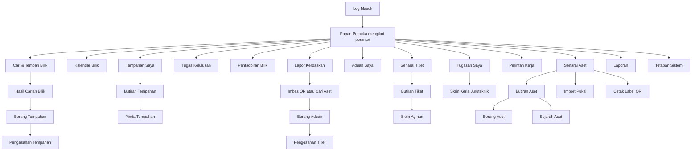

# 10 — Spesifikasi UI/UX

| Perkara | Butiran |
|---|---|
| Dokumen | UI/UX Specification |
| Sistem | SPFA — Sistem Pengurusan Fasiliti & Aset ICT |
| Versi | 1.0 (Draf) |
| Tarikh | 7 September 2026 |

---

## 1. Prinsip Reka Bentuk Antara Muka

1. **Laluan biasa mesti pantas.** Menempah bilik dan melaporkan kerosakan adalah dua tindakan yang paling kerap dilakukan. Kedua-duanya mesti boleh dimulakan dari mana-mana skrin dalam satu ketikan.
2. **Mudah alih bukan pemikiran kemudian.** Juruteknik bekerja di lapangan dengan telefon di satu tangan. Skrin mereka direka untuk mudah alih dahulu, kemudian dikembangkan untuk desktop.
3. **Status jelas tanpa warna.** Setiap status mempunyai label teks, bukan sekadar warna. Ini melayani pengguna buta warna dan cetakan hitam putih.
4. **Ralat menerangkan jalan keluar.** Mesej "tempahan gagal" tidak memadai. Mesej mesti menyatakan sebab dan mencadangkan tindakan seterusnya.
5. **Kurangkan medan.** Setiap medan wajib yang ditambah mengurangkan kadar penggunaan. Medan yang boleh diisi sistem tidak sepatutnya ditanya kepada pengguna.

## 2. Peta Skrin



## 3. Susun Atur Am

**Desktop (lebar melebihi 1024 piksel):** bar sisi kiri untuk navigasi utama, bar atas untuk carian global, notifikasi dan menu pengguna, kawasan kandungan utama di sebelah kanan.

**Mudah alih (lebar bawah 768 piksel):** bar navigasi bawah dengan empat item utama mengikut peranan, tajuk atas dengan butang kembali, kandungan menyusun secara menegak dalam satu lajur.

Navigasi bawah mudah alih mengikut peranan:

| Peranan | Item 1 | Item 2 | Item 3 | Item 4 |
|---|---|---|---|---|
| Kakitangan | Utama | Tempah | Aduan | Saya |
| Juruteknik | Utama | Tugasan | Imbas | Saya |
| Penyelia ICT | Utama | Tiket | Agih | Laporan |
| Pentadbir Fasiliti | Utama | Kalendar | Bilik | Laporan |

## 4. Wireframe Skrin Utama

### 4.1 Cari dan Tempah Bilik (desktop)

```
┌──────────────────────────────────────────────────────────────────────┐
│ SPFA          [ Carian global............ ]      🔔 3    Ahmad Zaki ▾ │
├────────────┬─────────────────────────────────────────────────────────┤
│            │  Cari Bilik Mesyuarat                                   │
│ ▸ Utama    │  ┌───────────────────────────────────────────────────┐  │
│ ▪ Tempah   │  │ Tarikh      [ 10/09/2026  ▾]                      │  │
│ ▸ Kalendar │  │ Masa mula   [ 10:00 ▾ ]   Tempoh [ 2 jam    ▾ ]   │  │
│ ▸ Tempahan │  │ Kapasiti    [ 12      ]   Bangunan [ Semua  ▾ ]   │  │
│   Saya     │  │ Kemudahan   ☑ Projektor ☐ Video ☑ Papan putih     │  │
│ ▸ Aduan    │  │                                    [ Cari Bilik ] │  │
│ ▸ Laporan  │  └───────────────────────────────────────────────────┘  │
│            │                                                         │
│            │  4 bilik tersedia pada 10 Sep 2026, 10:00–12:00        │
│            │  ┌───────────────────────────────────────────────────┐  │
│            │  │ [foto]  BM-A-301  Bilik Mesyuarat Utama           │  │
│            │  │         Bangunan A, Tingkat 3                     │  │
│            │  │         Kapasiti 20 · Projektor, Papan putih, VC  │  │
│            │  │         ⚑ Perlu kelulusan Ketua Bahagian          │  │
│            │  │                                    [ Tempah → ]   │  │
│            │  ├───────────────────────────────────────────────────┤  │
│            │  │ [foto]  BM-B-205  Bilik Perbincangan B            │  │
│            │  │         Bangunan B, Tingkat 2                     │  │
│            │  │         Kapasiti 14 · Projektor, Papan putih      │  │
│            │  │                                    [ Tempah → ]   │  │
│            │  └───────────────────────────────────────────────────┘  │
└────────────┴─────────────────────────────────────────────────────────┘
```

**Nota reka bentuk.** Penanda "perlu kelulusan" dipaparkan sebelum pengguna memilih bilik, bukan selepas menghantar borang. Pengguna berhak tahu bahawa tempahan tidak akan disahkan serta-merta sebelum melabur masa mengisi borang.

### 4.2 Borang Tempahan

```
┌──────────────────────────────────────────────────────────────────────┐
│ ← Kembali            Tempahan Baharu                                 │
├──────────────────────────────────────────────────────────────────────┤
│  BM-A-301 · Bilik Mesyuarat Utama                                    │
│  10 September 2026 · 10:00–12:00 · Bangunan A, Tingkat 3            │
│  ⚑ Tempahan ini memerlukan kelulusan Ketua Bahagian sebelum sah      │
│                                                                      │
│  Tajuk mesyuarat *                                                   │
│  [ Mesyuarat Jawatankuasa ICT Bil. 5/2026                        ]  │
│                                                                      │
│  Bilangan peserta *        Susun atur                                │
│  [ 12        ]             [ Bentuk U (maks 18)          ▾ ]        │
│                                                                      │
│  Tempah bagi pihak (pilihan)                                         │
│  [ Cari nama pegawai...                                          ]  │
│                                                                      │
│  Peserta (pilihan)                                                   │
│  [ + Tambah peserta dalaman ]  [ + Tambah e-mel luar ]              │
│  • Siti Aminah (Bahagian Kewangan)                          [ × ]   │
│                                                                      │
│  ▸ Permintaan sokongan (pilihan)                                     │
│                                                                      │
│  Catatan (pilihan)                                                   │
│  [                                                               ]  │
│                                                                      │
│                            [ Batal ]   [ Hantar Permohonan ]        │
└──────────────────────────────────────────────────────────────────────┘
```

**Nota reka bentuk.** Hanya dua medan wajib pada skrin ini kerana tarikh, masa dan bilik telah ditetapkan pada skrin sebelumnya. Bahagian permintaan sokongan dilipat secara lalai supaya tidak membebankan pengguna yang tidak memerlukannya.

### 4.3 Skrin Konflik Tempahan

```
┌──────────────────────────────────────────────────────────────────────┐
│  ⚠  Slot ini baru sahaja ditempah                                    │
│                                                                      │
│  Bilik Mesyuarat Utama telah ditempah untuk 10 September 2026,       │
│  10:00 hingga 12:00 oleh pengguna lain beberapa saat yang lalu.      │
│  Tempahan anda tidak disimpan.                                       │
│                                                                      │
│  Slot terdekat pada bilik yang sama:                                 │
│    ○ 10 Sep 2026, 12:30–14:30                    [ Pilih ]          │
│    ○ 11 Sep 2026, 10:00–12:00                    [ Pilih ]          │
│                                                                      │
│  Bilik lain yang sesuai pada masa asal:                              │
│    ○ BM-B-205 Bilik Perbincangan B (kapasiti 14) [ Pilih ]          │
│                                                                      │
│                       [ Cari semula ]   [ Kembali ]                 │
└──────────────────────────────────────────────────────────────────────┘
```

**Nota reka bentuk.** Konflik adalah kegagalan yang paling mengecewakan dalam sistem tempahan. Memaparkan alternatif serta-merta menukar kegagalan menjadi pilihan, dan mengelakkan pengguna mengulang carian dari awal.

### 4.4 Lapor Kerosakan (mudah alih)

```
┌─────────────────────────────┐
│ ← Lapor Kerosakan           │
├─────────────────────────────┤
│                             │
│   ┌───────────────────┐     │
│   │                   │     │
│   │   [ Imbas QR ]    │     │
│   │                   │     │
│   └───────────────────┘     │
│   Imbas kod pada peralatan  │
│                             │
│   ─────── atau ───────      │
│                             │
│   [ Cari no. pendaftaran ]  │
│   [ Peralatan saya (3)    ] │
│   [ Masalah umum lokasi   ] │
│                             │
├─────────────────────────────┤
│  Utama  Tempah  Aduan  Saya │
└─────────────────────────────┘
```

Selepas aset dikenal pasti:

```
┌─────────────────────────────┐
│ ← Lapor Kerosakan           │
├─────────────────────────────┤
│ ICT/KOMP/2024/0451          │
│ Dell OptiPlex 7010          │
│ Bangunan A, Tingkat 2, 214  │
│ ✓ Masih dalam waranti       │
├─────────────────────────────┤
│ Jenis masalah *             │
│ [ Tidak boleh hidup     ▾ ] │
│                             │
│ Keterangan *                │
│ ┌─────────────────────────┐ │
│ │ Komputer tidak menyala  │ │
│ │ selepas gangguan        │ │
│ │ elektrik semalam.       │ │
│ └─────────────────────────┘ │
│                             │
│ [ 📷 Tambah foto ]          │
│                             │
│ Tahap gangguan *            │
│ ○ Tidak boleh bekerja       │
│ ○ Ada jalan sementara       │
│ ○ Gangguan kecil            │
│                             │
│ [    Hantar Aduan       ]   │
└─────────────────────────────┘
```

**Nota reka bentuk.** Pengguna ditanya "tahap gangguan" dalam bahasa mereka, bukan "keutamaan P1 hingga P4". Sistem memetakan jawapan kepada keutamaan dalaman. Penyelia boleh melaraskannya kemudian.

### 4.5 Skrin Kerja Juruteknik (mudah alih)

```
┌─────────────────────────────┐
│ ← TKT-202609-00342          │
├─────────────────────────────┤
│ P2 · Dalam Tindakan         │
│ ⏱ Baki SLA: 6j 20m          │
├─────────────────────────────┤
│ ICT/KOMP/2024/0451          │
│ Dell OptiPlex 7010          │
│ Bangunan A, Tingkat 2, 214  │
│ ⚠ Dalam waranti hingga      │
│   14 Mac 2027               │
│ [ Lihat sejarah aset → ]    │
├─────────────────────────────┤
│ Pelapor: Ahmad Zaki         │
│ 📞 0123456789               │
│                             │
│ "Komputer tidak menyala     │
│ selepas gangguan elektrik   │
│ semalam."                   │
│ [foto kecil]                │
├─────────────────────────────┤
│ Diagnosis *                 │
│ [                         ] │
│                             │
│ Tindakan diambil *          │
│ [                         ] │
│                             │
│ Alat ganti digunakan        │
│ [ + Tambah item ]           │
│ • PSU 500W × 1  (baki 4)    │
│                             │
│ Kos (RM)      Masa (minit)  │
│ [ 180.00 ]    [ 45      ]   │
│                             │
│ [ 📷 Foto selepas baiki ]   │
│                             │
│ [ Simpan Draf ]             │
│ [ Tanda Kerja Selesai   ]   │
└─────────────────────────────┘
```

**Nota reka bentuk.** Baki masa SLA dipaparkan di bahagian atas kerana ia mempengaruhi keputusan juruteknik tentang susunan kerja. Amaran waranti dipaparkan berhampiran medan kos supaya juruteknik melihatnya sebelum merekod kos berbayar.

### 4.6 Papan Pemuka Penyelia ICT

```
┌──────────────────────────────────────────────────────────────────────┐
│  Papan Pemuka · Penyelia ICT                    September 2026        │
├──────────────────────────────────────────────────────────────────────┤
│  ┌────────────┐ ┌────────────┐ ┌────────────┐ ┌────────────┐        │
│  │ Belum      │ │ Dalam      │ │ Hampir     │ │ Melanggar  │        │
│  │ diagih     │ │ tindakan   │ │ langgar    │ │ SLA        │        │
│  │            │ │            │ │            │ │            │        │
│  │     7      │ │    14      │ │     3      │ │     1      │        │
│  └────────────┘ └────────────┘ └────────────┘ └────────────┘        │
│                                                                      │
│  Tiket Memerlukan Perhatian Segera                                   │
│  ┌────────────────────────────────────────────────────────────────┐ │
│  │ No. Tiket    Keutamaan  Aset          Juruteknik   Baki SLA    │ │
│  │ TKT-…00338   P1         Pelayan cetak  Faiz        ⚠ 0j 45m   │ │
│  │ TKT-…00340   P2         Komputer 214   Belum agih  ⚠ 1j 10m   │ │
│  │ TKT-…00335   P2         Pencetak L3    Aida        ⚠ 2j 05m   │ │
│  └────────────────────────────────────────────────────────────────┘ │
│                                                                      │
│  Beban Kerja Juruteknik            Prestasi SLA Bulan Ini            │
│  ┌───────────────────────────┐    ┌───────────────────────────────┐ │
│  │ Faiz      ████████  8     │    │ Dipatuhi     87%              │ │
│  │ Aida      █████     5     │    │ Dilanggar    13%              │ │
│  │ Rosli     ███       3     │    │ Purata masa pemulihan 9j 20m  │ │
│  └───────────────────────────┘    └───────────────────────────────┘ │
└──────────────────────────────────────────────────────────────────────┘
```

## 5. Sistem Reka Bentuk Visual

### 5.1 Warna status

Setiap status mempunyai warna dan label teks. Warna sahaja tidak pernah menjadi satu-satunya penanda.

| Status | Label | Warna | Penggunaan |
|---|---|---|---|
| Menunggu | Menunggu Kelulusan | Kuning gelap | Tempahan belum diluluskan |
| Aktif | Disahkan, Dalam Tindakan | Biru | Rekod sedang berjalan |
| Berjaya | Selesai, Ditutup | Hijau | Rekod tamat dengan baik |
| Amaran | Hampir Langgar SLA | Jingga | Perlu tindakan segera |
| Bahaya | Melanggar SLA, Ditolak | Merah | Masalah atau kegagalan |
| Neutral | Dibatalkan, Dilepaskan | Kelabu | Rekod tidak lagi aktif |

Nisbah kontras semua kombinasi teks dan latar mesti sekurang-kurangnya 4.5 banding 1.

### 5.2 Tipografi

| Elemen | Saiz | Berat |
|---|---|---|
| Tajuk halaman | 24 piksel | Tebal |
| Tajuk bahagian | 18 piksel | Separa tebal |
| Teks badan | 15 piksel | Biasa |
| Teks sokongan | 13 piksel | Biasa |
| Label medan | 14 piksel | Separa tebal |

Saiz minimum teks badan pada mudah alih adalah 16 piksel untuk mengelakkan zum automatik pada iOS.

### 5.3 Jarak

Sistem jarak berasaskan gandaan 4 piksel. Jarak antara medan borang 16 piksel, antara bahagian 32 piksel, dan padding dalam kad 16 piksel.

## 6. Mesej Sistem

Setiap mesej mengikut struktur yang sama: apa yang berlaku, mengapa, dan apa yang boleh dilakukan.

| Situasi | Mesej |
|---|---|
| Tempahan berjaya | Tempahan anda telah disahkan. Nombor rujukan TMP-202609-00187. E-mel pengesahan telah dihantar. |
| Tempahan menunggu kelulusan | Permohonan anda telah dihantar kepada Encik Rahman untuk kelulusan. Anda akan dimaklumkan melalui e-mel apabila keputusan dibuat. |
| Konflik tempahan | Bilik ini baru sahaja ditempah oleh pengguna lain. Tempahan anda tidak disimpan. Pilih slot lain di bawah. |
| Kapasiti melebihi | Bilik ini menampung 18 orang dalam susun atur bentuk U, tetapi anda memasukkan 25 peserta. Pilih susun atur lain atau bilik yang lebih besar. |
| Tempahan lewat dibatalkan | Tempahan dibatalkan. Kerana pembatalan dibuat kurang dua jam sebelum masa mula, ia direkod sebagai pembatalan lewat. |
| Tempahan menunggu kelulususan dibatalkan | Tempahan anda telah dibatalkan. Permohonan kelulususan telah ditarik balik dan pelulus dimaklumkan. Slot ini kini tersedia untuk kegunaan lain.|
| Belum daftar masuk | Tempahan anda bermula 5 minit yang lalu. Sila daftar masuk dalam 10 minit, atau bilik akan dilepaskan untuk pengguna lain. |
| Tiket dibuka | Aduan anda telah diterima. Nombor rujukan TKT-202609-00342. Anggaran masa penyelesaian: 8 September 2026, 10:30 pagi. |
| Amaran waranti | Aset ini masih dalam waranti sehingga 14 Mac 2027. Sila nyatakan sebab kerja berbayar sebelum merekod kos. |
| Stok tidak cukup | Baki PSU 500W hanya 2 unit, tetapi anda memerlukan 3. Hubungi penyelia untuk penambahan stok. |
| Tiada kebenaran | Anda tidak mempunyai kebenaran untuk melihat rekod ini. Jika anda percaya ini satu kesilapan, hubungi pentadbir sistem. |

## 7. Keadaan Kosong

Skrin tanpa data tidak boleh dibiarkan kosong. Setiap satu menerangkan keadaan dan menawarkan tindakan.

| Skrin | Mesej keadaan kosong |
|---|---|
| Tempahan saya | Anda belum mempunyai sebarang tempahan. Cari bilik untuk mesyuarat anda yang seterusnya. [ Cari Bilik ] |
| Aduan saya | Anda tidak mempunyai aduan aktif. Jika peralatan anda bermasalah, laporkan di sini. [ Lapor Kerosakan ] |
| Tugas kelulusan | Tiada permohonan menunggu kelulusan anda. |
| Tugasan juruteknik | Tiada tugasan untuk hari ini. Semak semula kemudian atau lihat semua tiket unit. |
| Hasil carian bilik | Tiada bilik yang memenuhi kriteria anda pada masa tersebut. Cuba kurangkan kapasiti, buang penapis kemudahan, atau pilih masa lain. [ Lihat slot berdekatan ] |

## 8. Kebolehcapaian

| Perkara | Keperluan |
|---|---|
| Navigasi papan kekunci | Semua fungsi utama boleh dicapai dengan Tab, Enter dan Esc. Susunan fokus mengikut susunan visual. |
| Penunjuk fokus | Setiap elemen boleh fokus mempunyai garis luar yang jelas, tidak dibuang melalui CSS. |
| Label borang | Setiap medan mempunyai elemen label yang dikaitkan, bukan sekadar teks pemegang tempat. |
| Mesej ralat | Dikaitkan dengan medan melalui atribut aria, dan diumumkan kepada pembaca skrin. |
| Jadual data | Menggunakan pengepala jadual yang betul supaya pembaca skrin dapat menyampaikan konteks lajur. |
| Ikon | Setiap ikon yang berdiri sendiri mempunyai label teks tersembunyi. |
| Kod QR | Sentiasa disertai nombor pendaftaran dalam teks, supaya masih boleh digunakan jika kamera gagal. |
