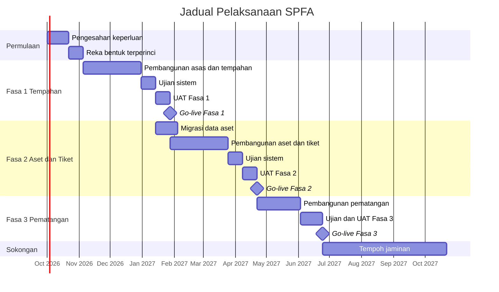

# 13 — Pelan Pelaksanaan Projek

| Perkara | Butiran |
|---|---|
| Dokumen | Implementation Plan |
| Sistem | SPFA — Sistem Pengurusan Fasiliti & Aset ICT |
| Versi | 1.0 (Draf) |
| Tarikh | 7 September 2026 |

---

## 1. Pendekatan Penyerahan

Projek dilaksanakan secara berperingkat. Setiap fasa menyerahkan sesuatu yang boleh digunakan sepenuhnya oleh sekurang-kurangnya satu kumpulan pengguna, bukan separuh siap yang menunggu fasa berikutnya.

Sebabnya praktikal. Sistem tempahan bilik yang lengkap memberi nilai walaupun modul aset belum wujud. Sebaliknya, membina kedua-dua domain separuh siap selama enam bulan bermakna tiada siapa mendapat faedah sehingga hari terakhir, dan maklum balas pengguna sebenar hanya tiba apabila terlalu lewat untuk bertindak.

## 2. Fasa dan Jadual

| Fasa | Tempoh | Tarikh sasaran | Penyerahan |
|---|---|---|---|
| Permulaan | 5 minggu | Okt 2026 | Keperluan disahkan, reka bentuk terperinci, persekitaran disediakan |
| Fasa 1 | 12 minggu | Nov 2026 hingga Feb 2027 | Tempahan bilik penuh dengan kelulusan, notifikasi dan laporan asas |
| Fasa 2 | 12 minggu | Feb hingga Mei 2027 | Inventori aset, tiket kerosakan, SLA, stok, laporan penyelenggaraan |
| Fasa 3 | 9 minggu | Mei hingga Julai 2027 | Daftar masuk, penyelenggaraan preventif, vendor, papan pemuka penuh |
| Jaminan | 6 bulan | Julai 2027 hingga Jan 2028 | Pembetulan kecacatan dan sokongan |

## 3. Struktur Pecahan Kerja

### Fasa Permulaan

| Kod | Aktiviti | Tempoh | Bergantung kepada | Penyerahan |
|---|---|---|---|---|
| P1.1 | Bengkel pengesahan keperluan dengan setiap persona | 1 minggu | — | Nota bengkel, keperluan dikemas kini |
| P1.2 | Penyelesaian isu terbuka dalam SRS | 2 minggu | P1.1 | Keputusan bertulis bagi ISU-01 hingga ISU-05 |
| P1.3 | Pengesahan senarai bilik dan kapasiti | 1 minggu | — | Senarai bilik disahkan pentadbir fasiliti |
| P1.4 | Reka bentuk pangkalan data terperinci | 2 minggu | P1.2 | Skema, fail migrasi |
| P1.5 | Reka bentuk antara muka aliran utama | 2 minggu | P1.1 | Prototaip boleh klik untuk 6 skrin utama |
| P1.6 | Penyediaan persekitaran pembangunan dan ujian | 1 minggu | — | Persekitaran berfungsi, saluran integrasi berterusan |
| P1.7 | Baseline keperluan | 3 hari | P1.2, P1.4, P1.5 | Dokumen berversi ditandatangani |

### Fasa 1 — Asas dan Tempahan

| Kod | Aktiviti | Tempoh | Bergantung kepada |
|---|---|---|---|
| F1.1 | Kerangka aplikasi, log masuk, pengurusan sesi | 2 minggu | P1.6 |
| F1.2 | Integrasi direktori organisasi | 1 minggu | F1.1 |
| F1.3 | Modul pengguna, peranan dan kawalan akses | 1.5 minggu | F1.1 |
| F1.4 | Modul lokasi dan organisasi | 1 minggu | F1.1 |
| F1.5 | Modul konfigurasi sistem | 1 minggu | F1.3 |
| F1.6 | Modul katalog bilik | 1.5 minggu | F1.4 |
| F1.7 | Enjin tempahan dan pengesanan konflik | 3 minggu | F1.6 |
| F1.8 | Paparan kalendar | 1.5 minggu | F1.7 |
| F1.9 | Modul kelulusan dan aliran kerja | 2 minggu | F1.7 |
| F1.10 | Modul notifikasi e-mel dan templat | 1.5 minggu | F1.5 |
| F1.11 | Jejak audit | 1 minggu | F1.3 |
| F1.12 | Laporan tempahan asas dan papan pemuka | 1.5 minggu | F1.7 |
| F1.13 | Penghalusan antara muka mudah alih | 1 minggu | F1.8 |
| F1.14 | Ujian sistem dan pembetulan | 2 minggu | Semua di atas |
| F1.15 | Penyediaan manual pengguna dan bahan latihan | 1 minggu | F1.13 |
| F1.16 | Latihan pengguna | 3 hari | F1.15 |
| F1.17 | UAT Fasa 1 | 2 minggu | F1.14, F1.16 |
| F1.18 | Pembetulan kecacatan UAT | 1 minggu | F1.17 |
| F1.19 | Penggunaan ke pengeluaran | 2 hari | F1.18 |

Aktiviti F1.7 diberi tempoh terpanjang kerana ia mengandungi logik yang paling kritikal dan paling sukar diperbetulkan kemudian. Ujian keserentakan termasuk dalam aktiviti ini, bukan ditangguhkan ke fasa ujian.

### Fasa 2 — Aset dan Tiket

| Kod | Aktiviti | Tempoh | Bergantung kepada |
|---|---|---|---|
| F2.0 | Pembersihan data aset oleh pegawai aset | 3 minggu | Selari dengan F1.14, dimulakan awal |
| F2.1 | Modul inventori aset dan kategori | 2.5 minggu | Fasa 1 selesai |
| F2.2 | Penjanaan kod QR dan cetakan label | 1 minggu | F2.1 |
| F2.3 | Import pukal dan pengesahan data | 1 minggu | F2.1 |
| F2.4 | Migrasi data aset sebenar | 1 minggu | F2.3, F2.0 |
| F2.5 | Sejarah aset, pemindahan dan pelupusan | 1.5 minggu | F2.1 |
| F2.6 | Modul tiket dan aliran kerja | 3 minggu | F2.1 |
| F2.7 | Kalkulator SLA dan amaran | 2 minggu | F2.6 |
| F2.8 | Modul stok alat ganti | 1.5 minggu | F2.6 |
| F2.9 | Antara muka mudah alih juruteknik | 1.5 minggu | F2.6 |
| F2.10 | Laporan penyelenggaraan dan papan pemuka penyelia | 2 minggu | F2.7 |
| F2.11 | Ujian sistem dan pembetulan | 2 minggu | Semua di atas |
| F2.12 | Cetakan dan penampalan label QR pada semua aset | 2 minggu | F2.4, selari dengan F2.11 |
| F2.13 | Latihan juruteknik, penyelia dan pegawai aset | 3 hari | F2.11 |
| F2.14 | UAT Fasa 2 | 2 minggu | F2.11, F2.13 |
| F2.15 | Pembetulan dan penggunaan | 1.5 minggu | F2.14 |

### Fasa 3 — Pematangan

| Kod | Aktiviti | Tempoh |
|---|---|---|
| F3.1 | Modul daftar masuk dan pelepasan automatik | 2 minggu |
| F3.2 | Modul penyelenggaraan preventif | 2.5 minggu |
| F3.3 | Modul vendor, kontrak dan waranti | 2 minggu |
| F3.4 | Modul permintaan sokongan mesyuarat | 1.5 minggu |
| F3.5 | Jemputan kalendar ICS dan penambahbaikan notifikasi | 1 minggu |
| F3.6 | Papan pemuka analitik penuh dan penjadualan laporan | 2 minggu |
| F3.7 | Ujian, UAT dan penggunaan | 3 minggu |

## 4. Sumber Manusia

| Peranan | Bilangan | Penglibatan | Tanggungjawab |
|---|---|---|---|
| Pengurus projek | 1 | Separuh masa | Jadual, risiko, komunikasi pemegang kepentingan |
| Penganalisis perniagaan | 1 | Sepenuh masa fasa permulaan, separuh masa selepas | Keperluan, UAT, latihan |
| Arkitek dan ketua teknikal | 1 | Sepenuh masa | Reka bentuk, semakan kod, keputusan teknikal |
| Pembangun bahagian belakang | 2 | Sepenuh masa | Perkhidmatan domain, API, pangkalan data |
| Pembangun bahagian hadapan | 1 | Sepenuh masa | Antara muka, kebolehcapaian, responsif |
| Penguji QA | 1 | Sepenuh masa dari Fasa 1 minggu 6 | Ujian sistem, automasi, penyelarasan UAT |
| Pentadbir sistem | 1 | Separuh masa | Persekitaran, penggunaan, sandaran |
| Pereka antara muka | 1 | Separuh masa fasa permulaan dan Fasa 1 | Prototaip, sistem reka bentuk |

Wakil pengguna daripada setiap persona diperlukan sekurang-kurangnya dua jam seminggu semasa fasa berkenaan. Ketiadaan mereka adalah punca kelewatan yang paling kerap dalam projek jenis ini.

## 5. Pelan Migrasi Data

### 5.1 Turutan

1. **Minggu 1 hingga 3 Fasa 2.** Pegawai aset membersihkan fail Excel menggunakan templat yang disediakan. Ini adalah kerja manual yang tidak boleh dipercepatkan oleh sistem, jadi ia dimulakan seawal mungkin.
2. **Minggu 4.** Import percubaan ke persekitaran ujian. Laporan ralat dikeluarkan.
3. **Minggu 5.** Pembetulan dalam fail sumber, bukan dalam pangkalan data. Import percubaan kedua.
4. **Minggu 6.** Import sebenar ke pengeluaran, dengan sandaran penuh sebelum dan selepas.
5. **Minggu 7 dan 8.** Pengesahan fizikal sampel 50 aset. Percanggahan diselesaikan.

### 5.2 Peraturan kualiti data

Baris ditolak jika: nombor pendaftaran kosong atau berulang, kategori tidak dikenali, atau tarikh perolehan tidak sah. Baris diterima dengan amaran jika: nombor siri kosong, pengguna tidak dapat dipadankan, atau lokasi tidak tepat pada aras ruang.

Prinsipnya, data yang tidak lengkap lebih baik daripada tiada data, tetapi data yang salah lebih buruk daripada tiada data. Medan pengenal mesti tepat; medan deskriptif boleh dilengkapkan kemudian.

## 6. Pelan Latihan

| Kumpulan | Bilangan | Tempoh | Kandungan | Bila |
|---|---|---|---|---|
| Kakitangan umum | Semua | 20 minit | Video pendek dan panduan satu halaman: cara tempah bilik dan lapor kerosakan | Minggu sebelum go-live setiap fasa |
| Setiausaha | 15 | 1 jam | Tempahan bagi pihak, tempahan berulang, permintaan sokongan | Fasa 1 |
| Pelulus | 10 | 30 minit | Senarai tugas kelulusan, penetapan wakil | Fasa 1 |
| Pentadbir fasiliti | 3 | 2 jam | Katalog bilik, peraturan, laporan | Fasa 1 |
| Juruteknik | 6 | 2 jam | Aplikasi mudah alih, imbasan QR, rekod kerja | Fasa 2 |
| Penyelia ICT | 2 | 2 jam | Agihan, pemantauan SLA, laporan | Fasa 2 |
| Pegawai aset | 2 | 3 jam | Pendaftaran, import pukal, label, pelupusan, pengauditan | Fasa 2 |
| Pentadbir sistem | 2 | 4 jam | Konfigurasi, pengguna, sandaran, penyelesaian masalah | Fasa 1 |

Latihan kakitangan umum sengaja dihadkan kepada 20 minit. Jika sistem memerlukan lebih daripada itu untuk tugas asas, masalahnya adalah pada reka bentuk antara muka, bukan pada latihan.

## 7. Strategi Go-Live

### Fasa 1

**Pendekatan:** berjalan seiring selama dua minggu. Tempahan melalui e-mel masih diterima, tetapi setiausaha memasukkannya ke dalam sistem. Ini mengumpul isu sebenar tanpa mengganggu operasi.

Selepas dua minggu, pekeliling rasmi menetapkan sistem sebagai satu-satunya saluran sah. Tanpa langkah ini, saluran lama akan kekal digunakan selama berbulan-bulan.

### Fasa 2

**Pendekatan:** peralihan terus untuk aduan kerosakan, kerana proses lama tidak formal dan tiada apa yang perlu diselaraskan. Nombor telefon meja bantuan kekal, tetapi setiap panggilan dimasukkan ke dalam sistem oleh penerima panggilan.

Modul aset bermula dengan data yang dimigrasikan. Pengauditan fizikal berjalan selari selama dua bulan pertama untuk membetulkan percanggahan.

### Senarai semak go-live

- [ ] Semua kecacatan kritikal dan tinggi ditutup
- [ ] Borang penerimaan UAT ditandatangani
- [ ] Sandaran pengeluaran diuji dengan pemulihan sebenar
- [ ] Pemantauan dan amaran dikonfigurasi
- [ ] Akaun pengguna dicipta dan peranan ditetapkan
- [ ] Konfigurasi sistem ditetapkan mengikut dasar organisasi
- [ ] Templat notifikasi disemak dan diluluskan
- [ ] Manual pengguna diterbitkan
- [ ] Latihan selesai untuk semua kumpulan
- [ ] Pekeliling rasmi dikeluarkan
- [ ] Meja bantuan bersedia dengan senarai soalan lazim
- [ ] Pelan pengunduran disediakan dan diuji

## 8. Sokongan Selepas Go-Live

| Tempoh | Aras sokongan |
|---|---|
| Minggu 1 dan 2 | Sokongan di tapak. Pasukan pembangunan hadir untuk tindak balas segera |
| Minggu 3 hingga 8 | Sokongan jauh dengan tindak balas dalam 4 jam bekerja |
| Bulan 3 hingga 6 | Tempoh jaminan. Pembetulan kecacatan dalam 2 hari bekerja untuk isu tinggi |
| Selepas bulan 6 | Kontrak penyelenggaraan berasingan atau penyerahan penuh kepada unit ICT dalaman |

## 9. Penyerahan Projek

Bahan berikut diserahkan pada penghujung tempoh jaminan.

| Bahan | Format |
|---|---|
| Kod sumber lengkap dengan sejarah versi | Repositori Git |
| Dokumentasi seni bina dan reka bentuk | Dokumen dalam repositori |
| Skema pangkalan data dan fail migrasi | Dalam repositori |
| Dokumentasi API | Dijana daripada kod, dihidangkan oleh aplikasi |
| Manual pengguna mengikut peranan | PDF dan halaman dalam sistem |
| Manual pentadbir dan operasi | PDF |
| Prosedur sandaran dan pemulihan | PDF dengan langkah yang telah diuji |
| Laporan ujian dan liputan | PDF |
| Laporan ujian penembusan dan penutupan penemuan | PDF |
| Daftar kecacatan terbuka dengan penilaian risiko | Hamparan |
| Bahan latihan dan rakaman video | Fail media |

## 10. Pengukuran Selepas Pelaksanaan

Kajian semula dijalankan tiga bulan dan dua belas bulan selepas go-live setiap fasa, mengukur KPI yang ditetapkan dalam BRS.

| Ukuran | Garis dasar | Sasaran 3 bulan | Sasaran 12 bulan |
|---|---|---|---|
| Peratusan tempahan melalui sistem | 0% | 80% | 98% |
| Kes pertindihan tempahan sebulan | Anggaran 8 | 0 | 0 |
| Kadar tidak hadir | Tidak diukur | Garis dasar ditetapkan | Turun 50% |
| Peratusan aduan melalui sistem | 0% | 90% | 98% |
| Pematuhan SLA | Tidak diukur | 80% | 90% |
| Ketepatan inventori aset | Anggaran 70% | 95% | 98% |
| Kepuasan pengguna | Tiada data | 3.5 daripada 5 | 4.0 daripada 5 |

Jika sasaran tiga bulan tidak dicapai, punca perlu disiasat sebelum meneruskan fasa berikutnya. Kadar penggunaan yang rendah biasanya bermakna masalah reka bentuk atau komunikasi, bukan masalah latihan.
